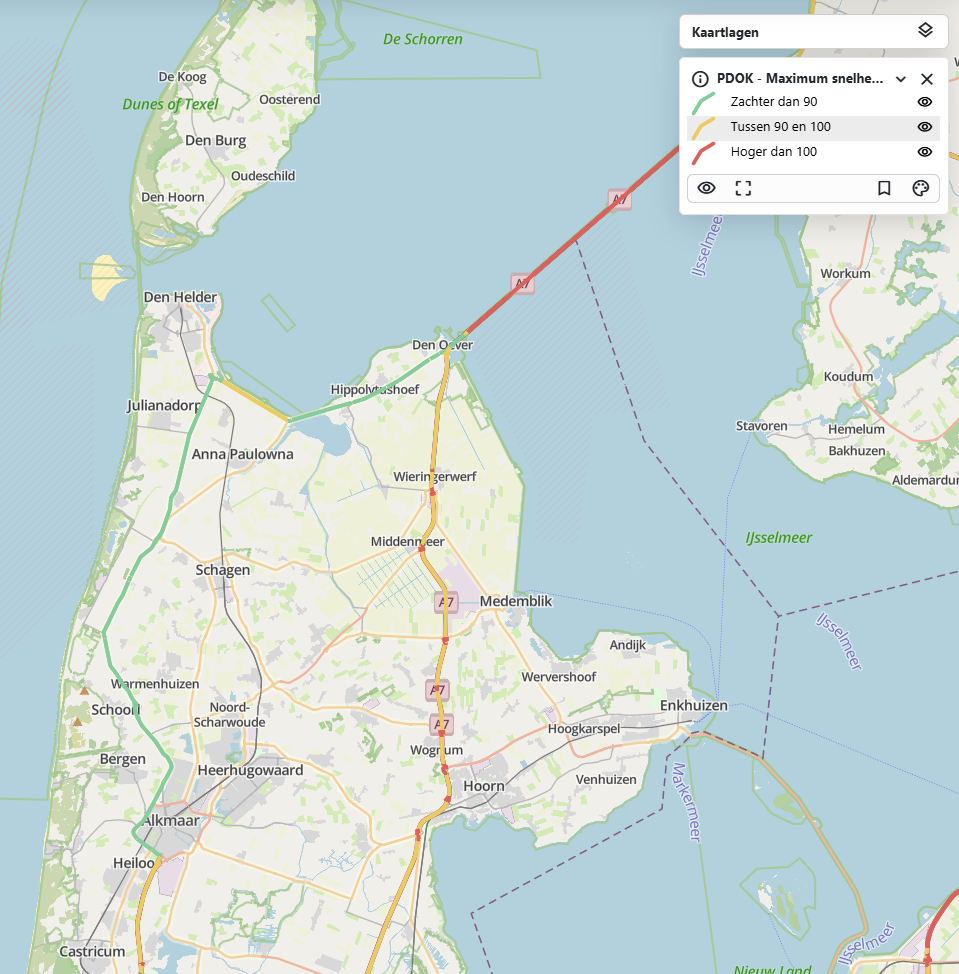

# {{ config.site_name }}

Lijnen
---
Voor deze handleiding over de styling van lijnen is gebruik gemaakt van de [dataset maximum snelheden wegvak overdag](https://nationaalgeoregister.nl/geonetwork/srv/dut/catalog.search#/metadata/abbf1e22-55aa-4a11-a855-7ac963e4a82c). Deze is te vinden in o.a. het nationaal georegister van PDOK.
Aan de hand van deze dataset zullen enkele voorbeelden gegeven worden van de stylingsmogelijkheden. Alle simpele styling voorbeelden zijn onderdeel van de “genereer style” functie in MapGallery. Vervolgens worden de [geavanceerde stylingopties](#geavanceerde-styling) besproken.

Simpele styling 
---

### Simpele lijn
```
{
  "name": "",
  "rules": [
    {
      "name": "PDOK - Maximum snelheden wegvak overdag",
      "filter": ["==", "$type", "LineString"],
      "symbolizers": [
        { "kind": "Line", "color": "#8e0d56", "width": 2, "opacity": 1 }
      ]
    }
  ]
}
```


De code hierboven is het resultaat van het genereren van een eenvoudige lijn weergave in MapGallery. Binnen rules zijn de stylingsregels beschreven. In de filter is gekozen voor alle geometrieën van het type "lineString".

- Het type symbool is "Line", ofwel een lijn op de kaart.
- De _kleur #8e0d56 in hex notatie, de code begint met # gevolgd door 6 tekens, bestaande uit drie paren, die respectievelijk de intensiteit van rood, groen en blauw (RGB) weergeven. Maar de basiskleuren worden ook herkend zoals red, green, indigo ect.
- De width bepaald de dikte van de lijn.
- De opacity bepaald de transparantie van de lijn.

### Lijnen met labels
```
{
  "name": "",
  "rules": [
    {
      "name": "Mirt lijnen fase",
      "filter": ["==", "$type", "LineString"],
      "symbolizers": [
        { "kind": "Line", "color": "purple", "width": 3, "opacity": 1 }
      ]
    },
    {
      "name": "Onderwerp",
      "symbolizers": [
        {
          "kind": "Text",
          "size": 15,
          "color": "darkblue",
          "label": { "args": ["onderwerp"], "name": "property" },
          "offset": [0, 2],
          "haloColor": "#FFFFFF",
          "haloWidth": 1,
        }
      ]
    }
  ]
}
```


Naast het gebruik van lijnen kan er ook informatie weergeven worden met labels. Hier is gekozen voor gebruik van het veld “onderwerp” voor de inhoud van de labels.

- De name bepaald hoe het label heet in de legenda, dit kan naar smaak aangepast worden.
Size en color kunnen net als bij de andere lijnen aangepast worden.
- Bij “args”, na label: word het veld opgegeven voor de inhoud van de labels, in dit geval ["onderwerp"]
- Onder offset word de afstand het label tot de lijn bepaald.
- De labels hebben ook een omlijning of zogeheten gloed, de kleur en grootte hiervan word bepaald met haloColor en haloWidth.

### Styling op categorie
```
{
  "name": "",
  "rules": [
    {
      "name": "30",
      "filter": ["==", "omschr", 30],
      "symbolizers": [
        { "kind": "Line", "color": "#1E90FF", "width": 3, "opacity": 1 }
      ]
    },
    {
      "name": "40",
      "filter": ["==", "omschr", 40],
      "symbolizers": [
        { "kind": "Line", "color": "#00CED1", "width": 3, "opacity": 1 }
      ]
    },
    {
      "name": "50",
      "filter": ["==", "omschr", 50],
      "symbolizers": [
        { "kind": "Line", "color": "#32CD32", "width": 3, "opacity": 1 }
      ]
    }
  ]
}
```


Het is mogelijk om aparte lijnen te genereren voor verschillende categorieën. Voor de dataset Maximum snelheden wegvak overdag is in dit voorbeeld gekozen voor styling op het veld "omschr". Het gewenste veld kan geselecteerd worden wanneer men “Weergave op categorie” selecteert binnen het de genereer style functie. Qua code verschilt er niet veel met voorgaande voorbeelden, behalve dat deze dan uit opeenvolgende blokken bestaat met een verschillende filterwaarde voor het veld "omschr". Let op, de voorbeeldcode beslaat alleen de eerste 3 types van de categorie.

!!! Note
    Als er geen velden staan onder het dropdown menu van 'Categorie veld'. Zorg dan dat bij het tabje “Velden” het aanpassen van velden is aangevinkt.

Geavanceerde styling
---

### Geavanceerde labels
xxxx

### Atribute-based lijnen
```
{
  "rules": [
    {
      "name": "Zachter dan 90",
      "filter": ["<", "omschr", 90],
      "symbolizers": [
        { "kind": "Line", "color": "#6FCF97", "width": 3, "opacity": 1 }
      ]
    },
    {
      "name": "Tussen 90 en 100",
      "filter": ["&&", [">=", "omschr", 90], ["<=", "omschr", 100]],
      "symbolizers": [
        { "kind": "Line", "color": "#F2C94C", "width": 3, "opacity": 1 }
      ]
    },
    {
      "name": "Hoger dan 100",
      "filter": [">", "omschr", 100],
      "symbolizers": [
        { "kind": "Line", "color": "#EB5757", "width": 3, "opacity": 1 }
      ]
    }
  ]
}
```


Deze stijl definieert hoe punten op een kaart worden weergegeven op basis van de maximale snelheden van het wegvak overdag van tabel "omschr"

- Voor snelden onder de 90 → een groene lijn. 
    - ["<", "omschr", 90]
- 1960–1990 → middelgrote blauwe cirkels (radius: 6).
    -  [">=", "jaar_van_ingebruikstelling", 1960], ["<", "jaar_van_ingebruikstelling", 1990]
- Na 1990 → grote donkerblauwe cirkels (radius: 8).
    - [">=", "jaar_van_ingebruikstelling", 1990]

Let op! Dit kan alleen worden gedaan als het datatype number is, anders kan deze styling niet.

### Lijn cap
xxxx

### Stippellijn
xxx

### Lijn met offset
xxx
