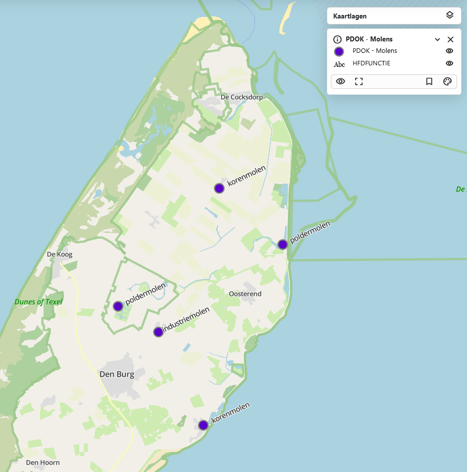

# {{ config.site_name }}

Geavanceerde styling
---

Introductie.......

### Labels

Voor de basis uitleg over labels (punten, lijnen en vlakken) ->>
*+* kan voor allemaal worden gebruikt

```
{
  "name": "",
  "rules": [
    {
      "name": "PDOK - Molens",
      "filter": ["==", "$type", "Point"],
      "symbolizers": [
        {
          "kind": "Mark",
          "color": "#5904c8",
          "radius": 7,
          "strokeColor": "gray",
          "strokeWidth": 2,
          "strokeOpacity": 1,
          "wellKnownName": "circle"
        }
      ]
    },
    {
      "name": "HFDFUNCTIE",
      "symbolizers": [
        {
          "font": ["georgia"],
          "kind": "Text",
          "size": 12,
          "color": "#000000",
          "label": { "args": ["HFDFUNCTIE"], "name": "property" },
          "offset": [4, 0],
          "rotate": -25,
          "opacity": 1,
          "haloColor": "#FFFFFF",
          "haloWidth": 1,
          "allowOverlap": true
        }
      ]
    }
  ]
}

```


Deze labels zijn geavandeerder, met meer optie voor persoonlijke voorkeur. Een groot gedeelte komt overeen met de simpele styling van labels. Hieronder worden de verschillende mogelijkheden uitgelegd:

-  Door een font te kiezen wordt het lettertype van het label aangepast. Dit zijn de mogelijke lettertypes die worden ondersteund:
    <ul>
    <li style="font-family: Arial;">Arial</li>
    <li style="font-family: Verdana;">Verdana</li>
    <li style="font-family: Sans-serif;">Sans-serif</li>
    <li style="font-family: 'Courier New';">Courier New</li>
     <li style="font-family: 'Lucida Console';">Lucida Console</li>
     <li style="font-family: Monospace;">Monospace</li>
     <li style="font-family: 'Times New Roman';">Times New Roman</li>
     <li style="font-family: Georgia;">Georgia</li>
     <li style="font-family: Serif;">Serif</li>
    </ul>
- Rotate zorgt ervoor dat de tekst schuin staat. "0" betekend dat de tekst recht blijft, bij "100" staat de tekst verticaal. Min getallen zijn ook mogelijk.  
- De opacity bepaald de transparantie van de tekst. "1" is normaal en "0" is onzichtbaar.
- De optie allowOverlap bepaalt of de labels elkaar mogen overlappen. Als overlappen niet is toegestaan, verschijnen alle labels pas bij verder inzoomen op de kaart. Als overlappen wel is toegestaan, kunnen sommige labels onzichtbaar zijn doordat ze elkaar bedekken.

