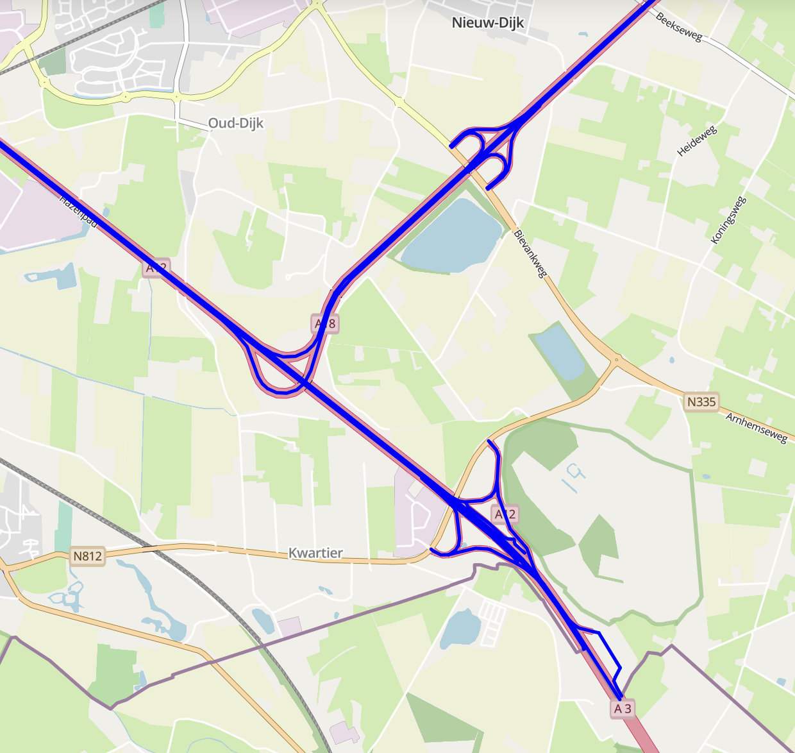
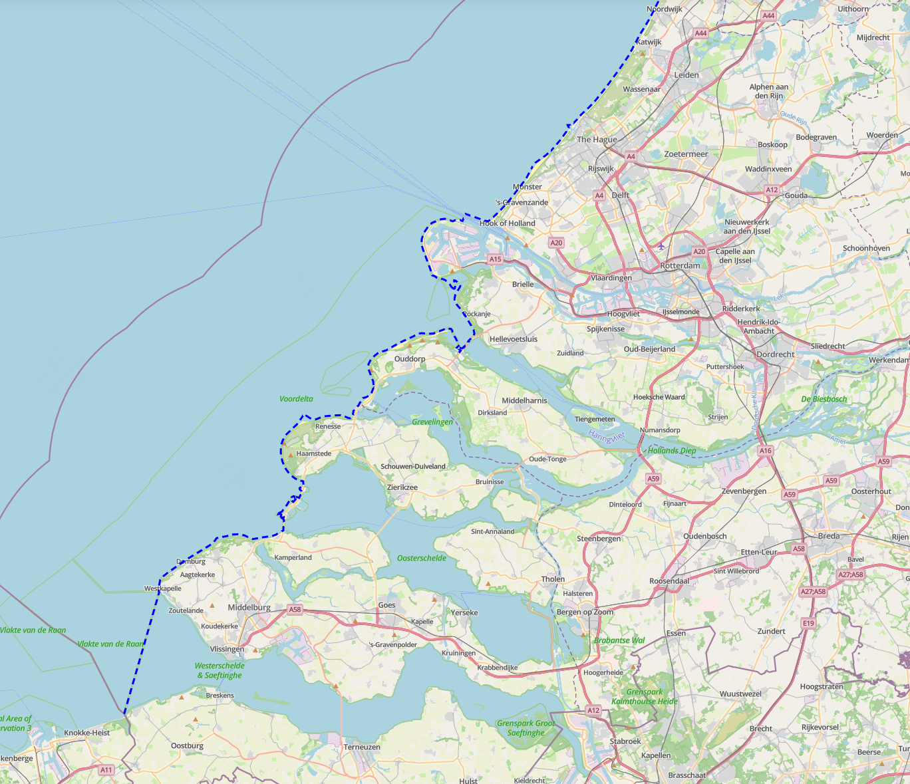
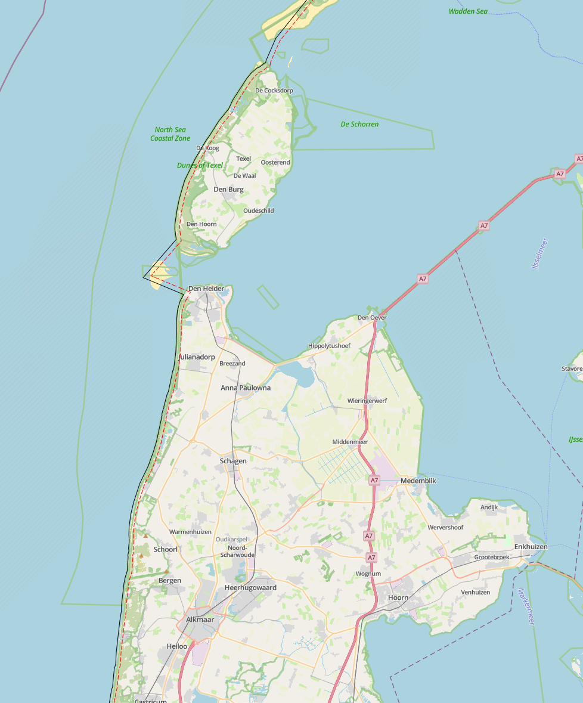
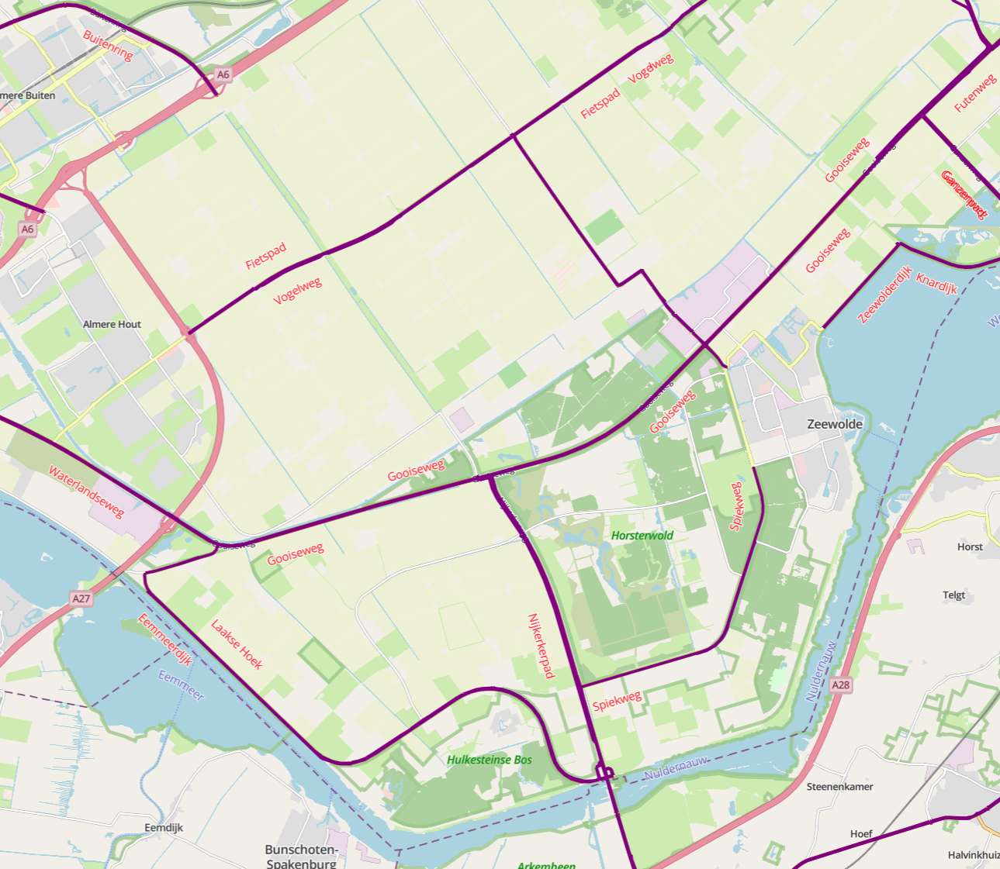
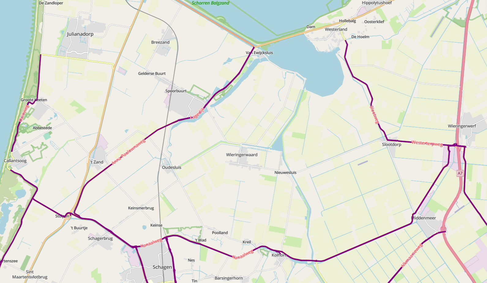

# {{ config.site_name }}

Geavanceerde styling
---


Nog in ontwikkeling


### Op attribuut-gebaseerd styling
In dit voorbeeld worden de punten aangepast op basis van kan kenmerken. 
```
{
  "name": "",
  "rules": [
    {
      "name": "Zachter dan 100",
      "filter": ["<", "omschr", 100],
      "symbolizers": [
        { "kind": "Line", "color": "#37ebb8", "width": 3, "opacity": 1 }
      ]
    },
    {
      "name": "80 - 120",
      "filter": ["&&", [">=", "omschr", 100], ["<", "omschr", 120]],
      "symbolizers": [
        { "kind": "Line", "color": "#20aba8", "width": 3, "opacity": 1 }
      ]
    },
    {
      "name": "Harder dan 120",
      "filter": [">", "omschr", 120],
      "symbolizers": [
        { "kind": "Line", "color": "#f732b8", "width": 3, "opacity": 1 }
      ]
    }
  ]
}
```


### Zoom-based punten


### Line cap
```
{
  "name": "",
  "rules": [
    {
      "name": "PDOK - Maximum snelheden wegvak overdag",
      "filter": ["==", "$type", "LineString"],
      "symbolizers": [
        {
          "cap": "round",
          "kind": "Line",
          "color": "blue",
          "width": 3,
          "opacity": 1
        }
      ]
    }
  ]
}
```


- butt: De lijn wordt recht afgesloten, met het einde van de lijn gelijk aan de lijn zelf.
- round: De lijn wordt afgerond, met een halve cirkel als einde.
- square: De lijn wordt vierkant afgesloten, een verlenging van de lijn zelf. 
(misschien nog een voorbeeld voor duidelijkheid)

### Stippellijn 
```
{
  "rules": [
    {
      "name": "",
      "symbolizers": [
        { "kind": "Line", "color": "#0000FF", "width": 3, "dasharray": [3, 2] }
      ]
    }
  ]
}
```


Door "dasharray" aan te passen wordt de stippellijn aangepast. De oneven getallen in de rij (de eerste, derde, ect.) bepalen de lengte van de lijn en de even getallen (de tweede, vierde, ect.) bepalen de lengte in pixels tussen de lijnen. 

### Offset lijn
```
{
  "rules": [
    {
      "name": "",
      "symbolizers": [
        {
          "kind": "Line",
          "color": "#000000"
        },
        {
          "kind": "Line",
          "color": "#FF0000",
          "dasharray": [
            5,
            2
          ],
          "perpendicularOffset": 5
        }
      ]
    }
  ]
}
```


"perpendicularOffset" zorgt ervoor dat er een extra lijn ontstaat die parallel loopt aan de orginele lijn. Het getal wordt gegeven in pixels en bij postitieve waardes wordt de extra lijn linkerkant en bij een negatieve waarde aan de rechterkant. 

### Labels lijn
```
{
  "name": "",
  "rules": [
    {
      "name": "Wegbeheerders provincie",
      "filter": ["==", "$type", "LineString"],
      "symbolizers": [
        { "kind": "Line", "color": "purple", "width": 3, "opacity": 1 }
      ]
    },
    {
      "name": "Stt naam",
      "symbolizers": [
        {
          "kind": "Text",
          "size": 12,
          "color": "red",
          "label": { "args": ["stt_naam"], "name": "property" },
          "offset": [0, 2],
          "haloColor": "#FFFFFF",
          "haloWidth": 1,
          "placement": "line",
          "allowOverlap": true
        }
      ]
    }
  ]
}
```


|                | offset | Afbeelding |
|----------------|---------|-------------|
| Naast de lijn | [0, 2] |  |
| Op de lijn    | [0, 0] |  |
