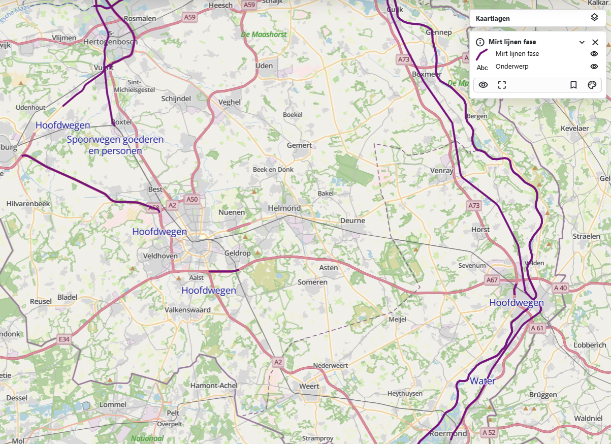
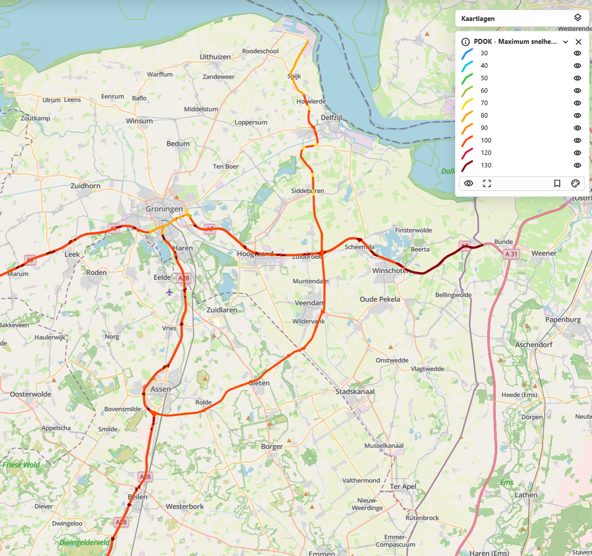
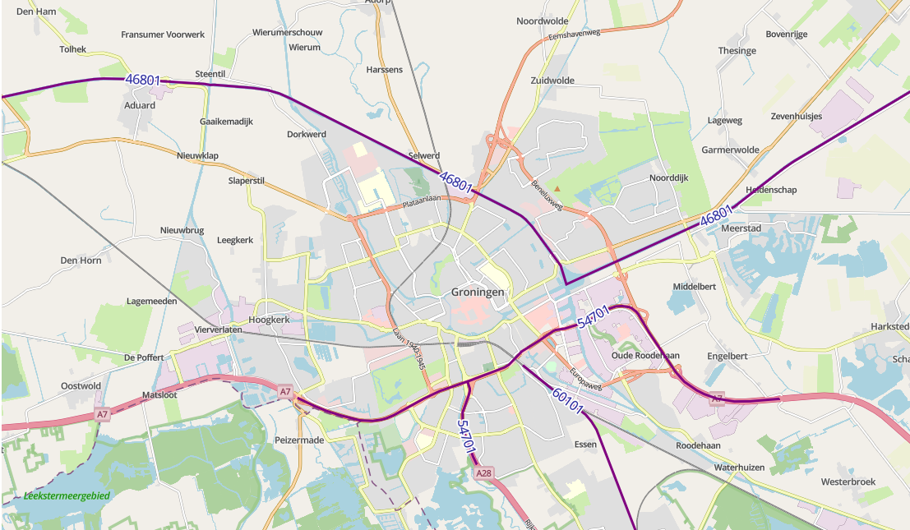
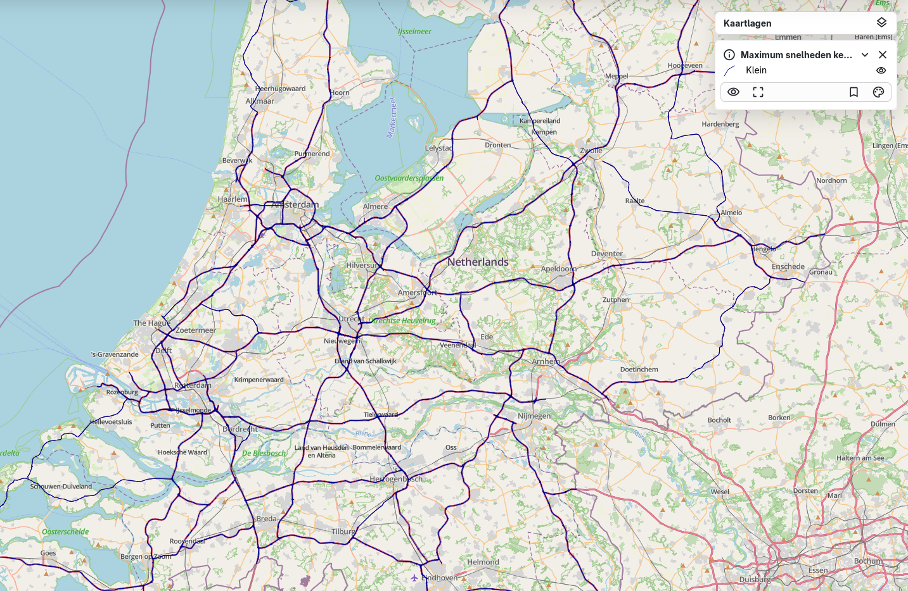

# {{ config.site_name }}

Lijnen
---
Voor deze handleiding over de styling van de lijnen is gebruik gemaakt van de dataset [maximum snelheden wegvak overdag](https://nationaalgeoregister.nl/geonetwork/srv/dut/catalog.search#/metadata/abbf1e22-55aa-4a11-a855-7ac963e4a82c), [MIRT](https://www.nationaalgeoregister.nl/geonetwork/srv/api/records/0dacfa79-c2de-4927-bc97-d36a11c3cf14?language=all) en [waterbeheergrens](https://www.nationaalgeoregister.nl/geonetwork/srv/api/records/ec6d6451-7ecd-4c25-b3ee-85845b01b513?language=all). Deze zijn te vinden in [het nationaal georegister van PDOK](https://www.nationaalgeoregister.nl).
Aan de hand van deze dataset zullen enkele voorbeelden gegeven worden van de stylingsmogelijkheden. Alle simpele styling voorbeelden zijn onderdeel van de “genereer style” functie in MapGallery. Vervolgens worden de [geavanceerde stylingopties](#geavanceerde-styling) besproken.

Simpele styling 
---

### Simpele lijn
```
{
  "name": "",
  "rules": [
    {
      "name": "PDOK - Maximum snelheden wegvak overdag",
      "filter": ["==", "$type", "LineString"],
      "symbolizers": [
        { "kind": "Line", "color": "#8e0d56", "width": 2, "opacity": 1 }
      ]
    }
  ]
}
```


De code hierboven is het resultaat van het genereren van een eenvoudige lijn weergave in MapGallery. Binnen rules zijn de stylingsregels beschreven. In de filter is gekozen voor alle geometrieën van het type "lineString".

- Het type symbool is "Line", ofwel een lijn op de kaart.
- De _kleur #8e0d56 in hex notatie, de code begint met # gevolgd door 6 tekens, bestaande uit drie paren, die respectievelijk de intensiteit van rood, groen en blauw (RGB) weergeven. Maar de basiskleuren worden ook herkend zoals red, green, indigo ect. Naast een hex code kunnen deze manieren ook: RGB, RGBA, HSL, HSLA en de 140 vooraf gedefinieerd HTML kleuren (zoals "yellow", "darkblue" en "tomato")  
- De width bepaald de dikte van de lijn.
- De opacity bepaald de transparantie van de lijn.

### Lijnen met labels
```
{
  "name": "",
  "rules": [
    {
      "name": "Mirt lijnen fase",
      "filter": ["==", "$type", "LineString"],
      "symbolizers": [
        { "kind": "Line", "color": "purple", "width": 3, "opacity": 1 }
      ]
    },
    {
      "name": "Onderwerp",
      "symbolizers": [
        {
          "kind": "Text",
          "size": 15,
          "color": "darkblue",
          "label": { "args": ["onderwerp"], "name": "property" },
          "offset": [0, 2],
          "haloColor": "#FFFFFF",
          "haloWidth": 1
        }
      ]
    }
  ]
}
```


Naast het gebruik van lijnen kan er ook informatie weergeven worden met labels. Hier is gekozen voor gebruik van het veld “onderwerp” voor de inhoud van de labels.

- De name bepaald hoe het label heet in de legenda, dit kan naar smaak aangepast worden.
Size en color kunnen net als bij de andere lijnen aangepast worden.
- Bij “args”, na label: word het veld opgegeven voor de inhoud van de labels, in dit geval ["onderwerp"]
- Onder offset word de afstand het label tot de lijn bepaald.
- De labels hebben ook een omlijning of zogeheten gloed, de kleur en grootte hiervan word bepaald met haloColor en haloWidth.

### Styling op categorie
```
{
  "name": "",
  "rules": [
    {
      "name": "30",
      "filter": ["==", "omschr", 30],
      "symbolizers": [
        { "kind": "Line", "color": "#1E90FF", "width": 3, "opacity": 1 }
      ]
    },
    {
      "name": "40",
      "filter": ["==", "omschr", 40],
      "symbolizers": [
        { "kind": "Line", "color": "#00CED1", "width": 3, "opacity": 1 }
      ]
    },
    {
      "name": "50",
      "filter": ["==", "omschr", 50],
      "symbolizers": [
        { "kind": "Line", "color": "#32CD32", "width": 3, "opacity": 1 }
      ]
    }
  ]
}
```


Het is mogelijk om aparte lijnen te genereren voor verschillende categorieën. Voor de dataset Maximum snelheden wegvak overdag is in dit voorbeeld gekozen voor styling op het veld "omschr". Het gewenste veld kan geselecteerd worden wanneer men “Weergave op categorie” selecteert binnen het de genereer style functie. Qua code verschilt er niet veel met voorgaande voorbeelden, behalve dat deze dan uit opeenvolgende blokken bestaat met een verschillende filterwaarde voor het veld "omschr". Let op, de voorbeeldcode beslaat alleen de eerste 3 types van de categorie.

!!! Note
    Als er geen velden staan onder het dropdown menu van 'Categorie veld'. Zorg dan dat bij het tabje “Velden” het aanpassen van velden is aangevinkt.

Geavanceerde styling
---

### Geavanceerde labels

```
{
  "name": "",
  "rules": [
    {
      "name": "Mirt lijnen fase",
      "filter": ["==", "$type", "LineString"],
      "symbolizers": [
        { "kind": "Line", "color": "purple", "width": 3, "opacity": 1 }
      ]
    },
    {
      "name": "Onderwerp",
      "symbolizers": [
        {
          "font": ["georgia"],
          "kind": "Text",
          "size": 16,
          "color": "darkblue",
          "label": { "args": ["mirtnrid"], "name": "property" },
          "offset": [0, 1],
          "haloColor": "#FFFFFF",
          "haloWidth": 2,
          "placement": "line",
          "allow Overlap": true
        }
      ]
    }
  ]
}
```
Deze labels zijn geavandeerder, met meer optie voor persoonlijke voorkeur. Een groot gedeelte komt overeen met de simpele styling van labels. Hieronder worden de verschillende mogelijkheden uitgelegd:

-  Door een font te kiezen wordt het lettertype van het label aangepast. Dit zijn de mogelijke lettertypes die worden ondersteund:
    <ul>
    <li style="font-family: Arial;">Arial</li>
    <li style="font-family: Verdana;">Verdana</li>
    <li style="font-family: Sans-serif;">Sans-serif</li>
    <li style="font-family: 'Courier New';">Courier New</li>
     <li style="font-family: 'Lucida Console';">Lucida Console</li>
     <li style="font-family: Monospace;">Monospace</li>
     <li style="font-family: 'Times New Roman';">Times New Roman</li>
     <li style="font-family: Georgia;">Georgia</li>
     <li style="font-family: Serif;">Serif</li>
    </ul>
- De opacity bepaald de transparantie/doorzichtigheid. "1" is normaal en "0" is onzichtbaar.
- De optie allowOverlap bepaalt of de labels elkaar mogen overlappen. Als overlappen niet is toegestaan, verschijnen alle labels pas bij verder inzoomen op de kaart. Als overlappen wel is toegestaan, kunnen sommige labels onzichtbaar zijn doordat ze elkaar bedekken.
- Onder offset word de afstand het label tot de lijn bepaald. Door de offset aan te passen naar [0, 0] staat het label op de lijn. Bij [0. 1] staat label er naast. 


|                | offset | Afbeelding |
|----------------|---------|-------------|
| Naast de lijn | [0, 1] |  |
| Op de lijn    | [0, 0] |  |


### Atribute-based lijnen
```
{
  "rules": [
    {
      "name": "Zachter dan 90",
      "filter": ["<", "omschr", 90],
      "symbolizers": [
        { "kind": "Line", "color": "#6FCF97", "width": 3, "opacity": 1 }
      ]
    },
    {
      "name": "Tussen 90 en 100",
      "filter": ["&&", [">=", "omschr", 90], ["<=", "omschr", 100]],
      "symbolizers": [
        { "kind": "Line", "color": "#F2C94C", "width": 3, "opacity": 1 }
      ]
    },
    {
      "name": "Hoger dan 100",
      "filter": [">", "omschr", 100],
      "symbolizers": [
        { "kind": "Line", "color": "#EB5757", "width": 3, "opacity": 1 }
      ]
    }
  ]
}
```


Deze stijl definieert hoe punten op een kaart worden weergegeven op basis van de maximale snelheden van het wegvak overdag van tabel "omschr"

- Voor snelheden onder de 90 km/u → een groene lijn. 
    - ["<", "omschr", 90]
- Voor snelheden tussem de 90 en 100 km/u → een gele lijn. 
    -  ["&&", [">=", "omschr", 90], ["<=", "omschr", 100]]
- Voor snelheden boven de 100 km/u → een rode lijn. 
    - [">", "omschr", 100]

Let op! Dit kan alleen worden gedaan als het datatype number is, anders kan deze styling niet.

### Zoom-based lijnen
```
{
  "rules": [
    {
      "name": "Groot",
      "symbolizers": [{ "kind": "Line", "size": 28, "color": "darkblue" }],
      "scaleDenominator": { "max": 100000 }
    },
    {
      "name": "Middel",
      "symbolizers": [{ "kind": "Line", "size": 14, "color": "darkblue" }],
      "scaleDenominator": { "max": 1000000, "min": 100000 }
    },
    {
      "name": "Klein",
      "symbolizers": [{ "kind": "Line", "size": 7, "color": "darkblue" }],
      "scaleDenominator": { "min": 1000000 }
    }
  ]
}

```

| Schaalniveau | Bereik | Afbeelding |
| ------------- | ------- | ----------- |
| Klein  | Vanaf 1 000 000 |   |
| Middel | 100 000 – 1 000 000 |   |
| Groot  | Tot 100 000 |   |

Met deze styling wordt de weergave van de lijnen afhankelijk van de schaal aangepast. In dit voorbeeld verandert de grootte van de lijn, en dit kan worden gestuurd met "scaleDenominator" door een min en/of max waarde te geven.

- "scaleDenominator": { "max": 100000 } betekent dat de stijl zichtbaar is bij een schaal van 1:100.000 of dichterbij (meer ingezoomd).
- "scaleDenominator": { "min": 50000 } betekent dat de stijl pas zichtbaar wordt bij een schaal van 1:50.000 of dichterbij.


### Lijn cap
```
{
  "name": "",
  "rules": [
    {
      "name": "PDOK - Maximum snelheden wegvak overdag",
      "filter": ["==", "$type", "LineString"],
      "symbolizers": [
        {
          "cap": "round",
          "kind": "Line",
          "color": "blue",
          "width": 3,
          "opacity": 1
        }
      ]
    }
  ]
}
```


- Butt: De lijn wordt recht afgesloten, met het einde van de lijn gelijk aan de lijn zelf. Dit is de default keuze
- Square: De lijn wordt vierkant afgesloten, een verlenging van de lijn zelf. 
- Round: De lijn wordt afgerond, met een halve cirkel als einde.


### Stippellijn
```
{
  "rules": [
    {
      "name": "",
      "symbolizers": [
        { "kind": "Line", "color": "#0000FF", "width": 3, "dasharray": [3, 2] }
      ]
    }
  ]
}
```


Door "dasharray" aan te passen wordt de stippellijn aangepast. De oneven getallen in de rij (de eerste, derde, ect.) bepalen de lengte van de lijn en de even getallen (de tweede, vierde, ect.) bepalen de lengte in pixels tussen de lijnen. 

### Lijn met offset
```
{
  "rules": [
    {
      "name": "",
      "symbolizers": [
        {
          "kind": "Line",
          "color": "#000000"
        },
        {
          "kind": "Line",
          "color": "#FF0000",
          "dasharray": [
            5,
            2
          ],
          "perpendicularOffset": 5
        }
      ]
    }
  ]
}
```


"perpendicularOffset" zorgt ervoor dat er een extra lijn ontstaat die parallel loopt aan de orginele lijn. Het getal wordt gegeven in pixels en bij postitieve waardes (bijv. 5) wordt de extra lijn linkerkant en bij een negatieve waarde (bijv. -5) aan de rechterkant. 

### Zichtbaar bij bepaald niveau
```
{
  "name": "",
  "rules": [
    {
      "name": "PDOK - CBS Bevolkingskernen 2021",
      "filter": ["==", "$type", "Polygon"],
      "symbolizers": [
        {
          "kind": "Fill",
          "color": "tomato",
          "opacity": 1,
          "outlineColor": "gray",
          "outlineWidth": 1,
          "outlineOpacity": 1
        }
      ],
"scaleDenominator": { "max": 700000 }
    }
  ]
}

```


Als er heel veel punten zijn kan het zijn dat je die niet de helet ijd wil laten zien. Maar pas bij een bepaald schaal. Bij deze styling zijn de punten bij 1:1.000.000 niet meer zichtbaar ({ "max": 1000000 }).