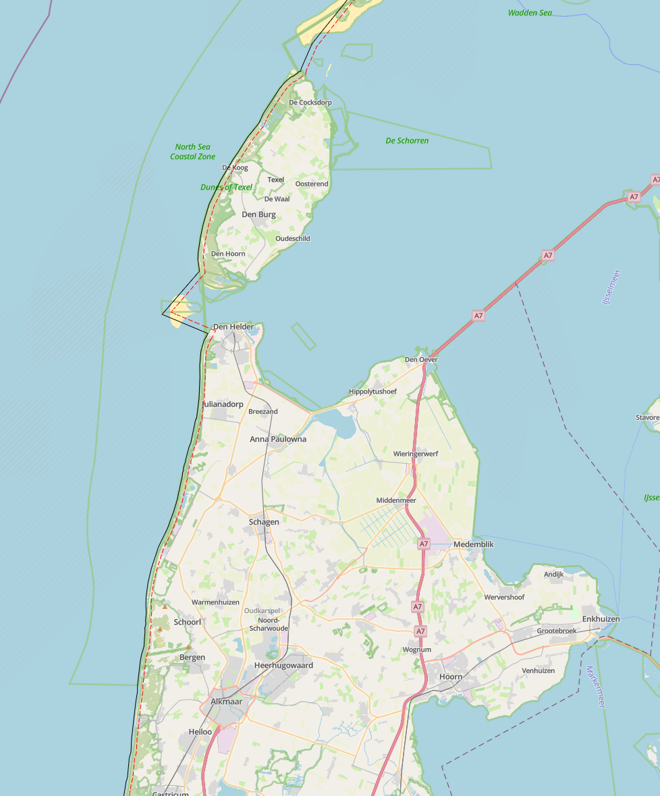

# {{ config.site_name }}

Lijnen
---
Voor deze handleiding over de styling van de lijnen is gebruik gemaakt van de dataset [Maximum snelheden wegvak overdag](https://nationaalgeoregister.nl/geonetwork/srv/dut/catalog.search#/metadata/abbf1e22-55aa-4a11-a855-7ac963e4a82c), [MIRT](https://www.nationaalgeoregister.nl/geonetwork/srv/api/records/0dacfa79-c2de-4927-bc97-d36a11c3cf14?language=all) en [Waterbeheergrens](https://www.nationaalgeoregister.nl/geonetwork/srv/api/records/ec6d6451-7ecd-4c25-b3ee-85845b01b513?language=all).
Aan de hand van deze dataset zullen enkele voorbeelden gegeven worden van de stylingsmogelijkheden. Alle simpele styling voorbeelden zijn onderdeel van de “genereer style” functie in MapGallery. Vervolgens worden de [geavanceerde stylingopties](#geavanceerde-styling) besproken.

Simpele styling
---

### Simpele lijn
```
{
  "name": "",
  "rules": [
    {
      "name": "PDOK - Maximum snelheden wegvak overdag",
      "filter": ["==", "$type", "LineString"],
      "symbolizers": [
        { "kind": "Line", "color": "#8e0d56", "width": 2, "opacity": 1 }
      ]
    }
  ]
}
```


De code hierboven is het resultaat van het genereren van een eenvoudige lijnweergave in MapGallery. Binnen rules zijn de opmaakregels beschreven. In de filter is gekozen voor alle geometrieën van het type `lineString`.

  - Het type symbool is `Mark`, oftewel een markering op de kaart.
  - De kleur #8e0d56 is weergegeven in hex-notatie. Naast een hexcode kunnen ook andere kleurnotaties worden gebruikt, zoals RGB, RGBA, HSL, HSLA, of een van de 140 vooraf gedefinieerde [HTML-kleuren](https://www.w3schools.com/colors/colors_names.asp) (bijvoorbeeld yellow, darkblue of tomato).
  - De `width` bepaalt de dikte van de lijn.
  - De `opacity` bepaalt de transparantie van de lijn.

### Lijnen met labels

```json
{
  "name": "",
  "rules": [
    {
      "name": "Mirt lijnen fase",
      "filter": ["==", "$type", "LineString"],
      "symbolizers": [
        { "kind": "Line", "color": "purple", "width": 3, "opacity": 1 }
      ]
    },
    {
      "name": "Onderwerp",
      "symbolizers": [
        {
          "kind": "Text",
          "size": 15,
          "color": "darkblue",
          "label": { "args": ["onderwerp"], "name": "property" },
          "offset": [0, 2],
          "haloColor": "#FFFFFF",
          "haloWidth": 1
        }
      ]
    }
  ]
}
```


Naast het gebruik van lijnen kan er ook informatie worden weergegeven met labels. In dit voorbeeld wordt `“onderwerp”` gebruikt als inhoud van de labels.

  - `name` bepaalt de naam van het label in de legenda. Deze kan naar wens worden aangepast.
  - `size` en `color` kunnen, net als bij de simpele lijn, vrij worden aangepast.
  - Bij `args` wordt het veld opgegeven dat de labeltekst bevat, in dit geval `"onderwerp"`.
  - Onder `offset` wordt de afstand van het label tot de lijn ingesteld. Dit zijn [x, y] coördinaten. Positieve waarden geven rechts en omlaag aan, terwijl negatieve waarden links en omhoog aangeven.
  - Labels kunnen een omlijning of gloed hebben. De kleur en dikte daarvan worden bepaald met `haloColor` en `haloWidth`.


### Styling op categorie
```json
{
  "name": "",
  "rules": [
    {
      "name": "30",
      "filter": ["==", "omschr", 30],
      "symbolizers": [
        { "kind": "Line", "color": "#1E90FF", "width": 3, "opacity": 1 }
      ]
    },
    {
      "name": "40",
      "filter": ["==", "omschr", 40],
      "symbolizers": [
        { "kind": "Line", "color": "#00CED1", "width": 3, "opacity": 1 }
      ]
    },
    {
      "name": "50",
      "filter": ["==", "omschr", 50],
      "symbolizers": [
        { "kind": "Line", "color": "#32CD32", "width": 3, "opacity": 1 }
      ]
    }
  ]
}
```


Het is mogelijk om aparte lijnen te genereren voor verschillende categorieën. In dit voorbeeld is er gekozen voor een styling op het veld `"omschr"`. Het gewenste veld kan worden geselecteerd door “Weergave op categorie” te kiezen binnen de functie Genereer stijl. Qua code verschilt dit nauwelijks van eerdere voorbeelden. Het verschil is dat de code nu bestaat uit verschillende blokken, elk met een andere filterwaarde voor het veld `"omschr"`.

Let op: het bovenstaande voorbeeldcode toont alleen de eerste drie typen uit de categorie.

!!! Info
    Als er geen velden staan onder het dropdown menu van 'Categorie veld'. Zorg dan dat bij het tabje “Velden” het aanpassen van velden is aangevinkt.

Geavanceerde styling
---

### Geavanceerde labels

```json
{
  "name": "",
  "rules": [
    {
      "name": "Mirt lijnen fase",
      "filter": ["==", "$type", "LineString"],
      "symbolizers": [
        { "kind": "Line", "color": "purple", "width": 3, "opacity": 1 }
      ]
    },
    {
      "name": "Onderwerp",
      "symbolizers": [
        {
          "font": ["georgia"],
          "kind": "Text",
          "size": 16,
          "color": "darkblue",
          "label": { "args": ["mirtnrid"], "name": "property" },
          "offset": [0, 1],
          "haloColor": "#FFFFFF",
          "haloWidth": 2,
          "placement": "line",
          "allow Overlap": true
        }
      ]
    }
  ]
}
```
Deze labels zijn geavanceerder en bieden meer mogelijkheden voor persoonlijke voorkeur. Een groot deel van de instellingen komt overeen met de eenvoudige labelstyling. Hieronder worden de verschillende opties toegelicht:

-  Door een `font` te kiezen wordt het lettertype van het label aangepast. De volgende lettertypen worden ondersteund:
    <ul>
    <li style="font-family: Arial;">Arial</li>
    <li style="font-family: Verdana;">Verdana</li>
    <li style="font-family: Sans-serif;">Sans-serif</li>
    <li style="font-family: 'Courier New';">Courier New</li>
     <li style="font-family: 'Lucida Console';">Lucida Console</li>
     <li style="font-family: Monospace;">Monospace</li>
     <li style="font-family: 'Times New Roman';">Times New Roman</li>
     <li style="font-family: Georgia;">Georgia</li>
     <li style="font-family: Serif;">Serif</li>
    </ul>
- `opacity` bepaalt de transparantie van het label.
    - Een waarde van 1 betekent volledig zichtbaar.
    - Een waarde van 0 maakt het label volledig onzichtbaar.
- `allowOverlap` bepaalt of labels elkaar mogen overlappen.
    - Wanneer overlappen niet is toegestaan, verschijnen labels pas bij verder inzoomen op de kaart.
    - Wanneer overlappen wel is toegestaan, kunnen labels gedeeltelijk of volledig overlapt worden door andere labels.
- Onder `offset` wordt de afstand van het label tot de lijn bepaald. Dit zijn [x, y] coördinaten. Positieve waarden geven rechts en omlaag aan, terwijl negatieve waarden links en omhoog aangeven.
    - Bij een instelling van [0, 0] staat het label recht op de lijn.
    - Bij een instelling van bijvoorbeeld [0, 1] wordt het label naast de lijn geplaatst.


|                | `offset` | Afbeelding |
|----------------|---------|-------------|
| Naast de lijn | [0, 1] |  |
| Op de lijn    | [0, 0] |  |


### Atribute-based lijnen
```json
{
  "rules": [
    {
      "name": "Zachter dan 90",
      "filter": ["<", "omschr", 90],
      "symbolizers": [
        { "kind": "Line", "color": "#6FCF97", "width": 3, "opacity": 1 }
      ]
    },
    {
      "name": "Tussen 90 en 100",
      "filter": ["&&", [">=", "omschr", 90], ["<=", "omschr", 100]],
      "symbolizers": [
        { "kind": "Line", "color": "#F2C94C", "width": 3, "opacity": 1 }
      ]
    },
    {
      "name": "Hoger dan 100",
      "filter": [">", "omschr", 100],
      "symbolizers": [
        { "kind": "Line", "color": "#EB5757", "width": 3, "opacity": 1 }
      ]
    }
  ]
}
```


Deze stijl bepaalt hoe de lijnen op de kaart worden weergegeven op basis van de kolom `"omschr`". 

- Voor snelheden onder de 90 km/u → een groene lijn. 
    - `["<", "omschr", 90]`
- Voor snelheden tussem de 90 en 100 km/u → een gele lijn. 
    -  `["&&", [">=", "omschr", 90], ["<=", "omschr", 100]]`
- Voor snelheden boven de 100 km/u → een rode lijn. 
    - `[">", "omschr", 100]`

!!! warning

    Let op: deze stijl kan alleen worden toegepast als het datatype van het veld numeriek (number) is. Wanneer het veld een ander datatype heeft, werkt deze vorm van styling niet.

### Zoom-based lijnen
```json
{
  "rules": [
    {
      "name": "Groot",
      "symbolizers": [{ "kind": "Line", "size": 28, "color": "darkblue" }],
      "scaleDenominator": { "max": 100000 }
    },
    {
      "name": "Middel",
      "symbolizers": [{ "kind": "Line", "size": 14, "color": "darkblue" }],
      "scaleDenominator": { "max": 1000000, "min": 100000 }
    },
    {
      "name": "Klein",
      "symbolizers": [{ "kind": "Line", "size": 7, "color": "darkblue" }],
      "scaleDenominator": { "min": 1000000 }
    }
  ]
}

```

| Schaalniveau | Bereik | Afbeelding |
| ------------- | ------- | ----------- |
| Klein  | Vanaf 1 000 000 |   |
| Middel | 100 000 – 1 000 000 |   |
| Groot  | Tot 100 000 |   |

Met deze styling wordt de weergave van de lijnen afhankelijk gemaakt van de schaal. In dit voorbeeld verandert de grootte van het lijn op basis van het zoomniveau. Dit gedrag wordt geregeld met de `scaleDenominator`, waarin een minimale en/of maximale waarde kan worden opgegeven.

- `"scaleDenominator": { "max": 100000 }`: De stijl is zichtbaar tot een schaal van 1:100.000, dus wanneer je dichterbij bent (meer ingezoomd).
- `"scaleDenominator": { "min": 50000 }`: De stijl wordt zichtbaar vanaf een schaal van 1:50.000, dus wanneer je verder uitzoomt.

Op deze manier kan de kaart verschillende weergaven tonen op verschillende zoomniveaus, wat zorgt voor een overzichtelijke en schaalafhankelijke visualisatie. Dit voorbeeld kan goed worden gecombineerd met andere voorbeelden uit dit kookboek: bij een hoge schaal kan een stippellijn worden weergegeven, terwijl deze bij uitzoomen wordt vereenvoudigd tot een eenvoudige lijn.

### Lijn cap
```json
{
  "name": "",
  "rules": [
    {
      "name": "PDOK - Maximum snelheden wegvak overdag",
      "filter": ["==", "$type", "LineString"],
      "symbolizers": [
        {
          "cap": "round",
          "kind": "Line",
          "color": "blue",
          "width": 3,
          "opacity": 1
        }
      ]
    }
  ]
}
```

De manier waarop een lijn eindigt wordt bepaald met de eigenschap `cap`. Er zijn drie mogelijke instellingen:

- `Butt`: De lijn wordt recht afgesloten, met het einde van de lijn gelijk aan de lijn zelf. Dit is de default keuze.
- `Round`: De lijn wordt afgerond, met een halve cirkel als einde.
- `Square`: De lijn wordt vierkant afgesloten, een verlenging van de lijn zelf. 


### Stippellijn
```json
{
  "rules": [
    {
      "name": "",
      "symbolizers": [
        { "kind": "Line", "color": "#0000FF", "width": 3, "dasharray": [3, 2] }
      ]
    }
  ]
}
```


Met de eigenschap `dasharray` wordt de stijl van een stippellijn bepaald. De waarden in de reeks bestaan uit afwisselend lijnlengtes en tussenruimtes. De oneven getallen (de eerste, derde, enzovoort) geven de lengte van de lijnsegmenten aan, terwijl de even getallen (de tweede, vierde, enzovoort) de afstand tussen de segmenten bepalen.

`"dasharray": [3, 2]` maakt een patroon van drie pixels lijn gevolgd door twee pixels ruimte, dat zich herhaalt over de hele lijn.


### Lijn met offset
```json
{
  "rules": [
    {
      "name": "",
      "symbolizers": [
        {
          "kind": "Line",
          "color": "#000000"
        },
        {
          "kind": "Line",
          "color": "#FF0000",
          "dasharray": [
            5,
            2
          ],
          "perpendicularOffset": 5
        }
      ]
    }
  ]
}
```


De eigenschap `perpendicularOffset` zorgt ervoor dat er een extra lijn wordt weergegeven die parallel loopt aan de oorspronkelijke lijn. De waarde wordt opgegeven in pixels. Bij een positieve waarde (bijvoorbeeld 5) verschijnt de extra lijn aan de linkerkant van de originele lijn, terwijl bij een negatieve waarde (bijvoorbeeld -5) de extra lijn aan de rechterkant wordt geplaatst.


### Zichtbaar bij bepaald niveau
```json
{
  "name": "",
  "rules": [
    {
      "name": "PDOK - Maximum snelheden wegvak overdag",
      "filter": ["==", "$type", "LineString"],
      "symbolizers": [
        { "kind": "Line", "color": "#ae4ffb", "width": 5, "opacity": 1 }
      ],
      "scaleDenominator": { "max": 700000 }
    }
  ]
}
```


Wanneer er veel lijnen op de kaart staan, is het niet altijd wenselijk om deze op alle schaalniveaus zichtbaar te houden. Het kan overzichtelijker zijn om ze pas te tonen vanaf een bepaald zoomniveau. In dit voorbeeld worden de lijnen alleen weergegeven bij een schaal kleiner dan 1:700.000. Dat is ingesteld met de eigenschap: `"scaleDenominator": { "max": 700000 }`.

Hierdoor zijn de lijnen zichtbaar wanneer verder wordt ingezoomd, maar verdwijnen ze automatisch bij het uitzoomen naar 1:700.000 of kleiner detailniveau. Op deze manier blijft de kaart overzichtelijk en worden te veel overlappende symbolen op grote schaalniveaus voorkomen.

### Lijn met omlijning
```json
{
  "name": "",
  "rules": [
    {
      "name": "Mirt",
      "filter": ["==", "$type", "LineString"],
      "symbolizers": [
        { "kind": "Line", "color": "#800080", "width": 6, "opacity": 1 },
        { "kind": "Line", "color": "#9190f8", "width": 3, "opacity": 1 }
      ]
    }
  ]
}
```


Om een lijn met een omlijning te maken, worden twee lijnlagen boven elkaar gebruikt met verschillende diktes en kleuren, zodat de omlijning duidelijk zichtbaar is. Het bovenstaande voorbeeld laat zien hoe dit kan worden toegepast:
- Eerste lijn: tekent de onderliggende lijn iets breder (`width`: 6) en vormt zo de omlijning.
- Tweede lijn: tekent de dunnere lijn erbovenop (`width`: 3), die de hoofdvorm van de lijn bepaalt.