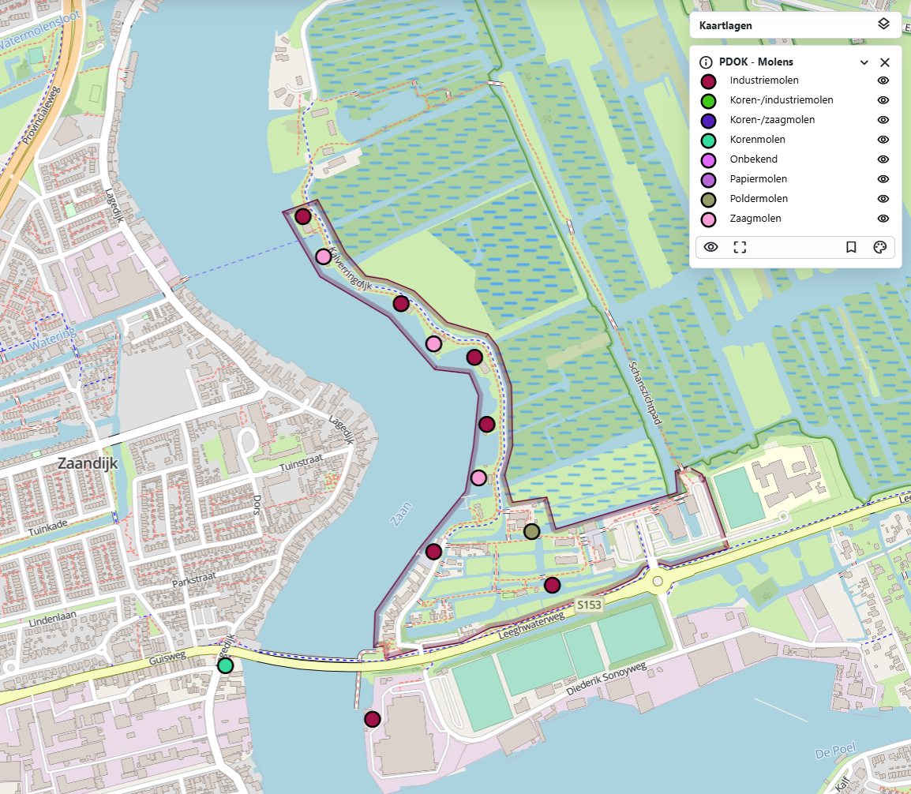
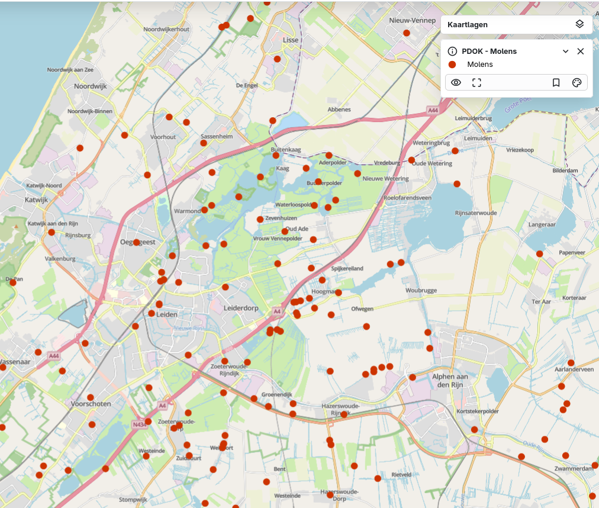

# {{ config.site_name }}

Punten
---
Voor deze handleiding over de styling van punten is gebruik gemaakt van de dataset [Molens](https://nationaalgeoregister.nl/geonetwork/srv/dut/catalog.search#/metadata/291afe4b-4f4b-497c-8026-fb437c4e9c7e) en [Vuurtorens](https://www.nationaalgeoregister.nl/geonetwork/srv/api/records/559aec8c-a2e3-472a-9de0-3a4bd365c46d?language=all). Deze zijn te vinden in [het nationaal georegister van PDOK](https://www.nationaalgeoregister.nl).
Aan de hand van deze dataset zullen enkele voorbeelden gegeven worden van de stylingsmogelijkheden. Alle simpele styling voorbeelden zijn onderdeel van de “genereer style” functie in MapGallery. Vervolgens worden de [geavanceerde stylingopties](#geavanceerde-styling) besproken.

Simpele styling 
---

### Simpele punt
```json
 {
  "name": "",
  "rules": [
    {
      "name": "Molens",
      "filter": ["==", "$type", "Point"],
      "symbolizers": [
        {
          "kind": "Mark",
          "color": "#12cdf3",
          "radius": 7,
          "strokeColor": "black",
          "strokeWidth": 2,
          "strokeOpacity": 1,
          "wellKnownName": "circle"
        }
      ]
    }
  ]
}
```


De code hierboven is het resultaat van het genereren van een eenvoudige puntweergave in MapGallery. Binnen rules zijn de opmaakregels beschreven. In de filter is gekozen voor alle geometrieën van het type "Point".

- Het type symbool is "Mark", oftewel een markering op de kaart.
- De kleur #12cdf3 is weergegeven in hex-notatie. De code begint met een hekje (#) gevolgd door zes tekens, bestaande uit drie paren die de intensiteit van rood, groen en blauw (RGB) weergeven. Naast een hexcode kunnen ook andere kleurnotaties worden gebruikt, zoals RGB, RGBA, HSL, HSLA, of een van de 140 vooraf gedefinieerde HTML-kleuren (bijvoorbeeld yellow, darkblue of tomato).
- De grootte (radius) bedraagt op dit moment 7 pixels.
- De strokeColor bepaalt de kleur van de omlijning, die in dit geval zwart is. Hiervoor kunnen dezelfde kleurnotaties worden toegepast als bij de vulling van het punt.
- De strokeWidth bepaalt de dikte van de omlijning.
- De strokeOpacity bepaalt de transparantie van het punt.
- Met wellKnownName wordt de vorm van het symbool vastgelegd. In dit geval betreft het een cirkel. Alternatieven zijn bijvoorbeeld vierkant of driehoek, al wordt momenteel alleen de cirkel ondersteund.

### Afbeelding als symbool
```json
{
  "name": "",
  "rules": [
    {
      "name": "Molens",
      "filter": ["==", "$type", "Point"],
      "symbolizers": [
        {
          "kind": "Icon",
          "size": 7,
          "image": "https://upload.wikimedia.org/wikipedia/commons/8/81/Windmill_-_Delapouite_-_game-icons.svg",
          "sizeUnit": "m",
          "allowOverlap": true
        }
      ]
    }
  ]
}
```

  
Het is ook mogelijk een zelfgekozen afbeelding te gebruiken om punten weer te geven met het symbooltype Icon.

- Bij image wordt de URL van de gewenste afbeelding opgegeven. Dit moet een directe link zijn die eindigt op het bestandsformaat, zoals .jpg, .svg of .png. Een betrouwbare bron voor geschikte afbeeldingen is bijvoorbeeld [Wikimedia Commons](https://commons.wikimedia.org/wiki/Category:Images).
- De optie allowOverlap bepaalt of de afbeeldingen elkaar mogen overlappen.
  - Wanneer overlappen niet is toegestaan, worden symbolen pas zichtbaar bij verder inzoomen op de kaart.
  - Wanneer overlappen wel is toegestaan, kunnen symbolen gedeeltelijk of volledig bedekt worden door andere symbolen.

### Punten met labels 
```json
{
  "name": "",
  "rules": [
    {
      "name": "Molens",
      "filter": ["==", "$type", "Point"],
      "symbolizers": [
        {
          "kind": "Mark",
          "color": "#12cdf3",
          "radius": 7,
          "strokeColor": "black",
          "strokeWidth": 2,
          "strokeOpacity": 1,
          "wellKnownName": "circle"
        }
      ]
    },
    {
      "name": "TYPE",
      "symbolizers": [
        {
          "kind": "Text",
          "size": 12,
          "color": "#111111",
          "label": { "args": ["TYPE"], "name": "property" },
          "offset": [0, 2],
          "haloColor": "#FFFFFF",
          "haloWidth": 1
        }
      ]
    }
  ]
}
```


Naast het gebruik van symbolen kan ook informatie worden weergegeven met labels. In dit voorbeeld wordt het veld “TYPE” gebruikt als inhoud van de labels.

- name bepaalt de naam van het label in de legenda. Deze kan naar wens worden aangepast. In dit voorbeeld bijvoorbeeld naar "Type molen"
- size en color kunnen, net als bij symbolen, vrij worden aangepast.
- Bij args, na label, wordt het veld opgegeven dat de labeltekst bevat, in dit geval "TYPE".
- Onder offset wordt de afstand van het label tot het punt ingesteld.
- Labels kunnen een omlijning of gloed hebben. De kleur en dikte daarvan worden bepaald met haloColor en haloWidth.

### Syling op categorie 
```json
{
  "name": "",
  "rules": [
    {
      "name": "Industriemolen",
      "filter": ["==", "HFDFUNCTIE", "industriemolen"],
      "symbolizers": [
        {
          "kind": "Mark",
          "color": "#a21248",
          "radius": 7,
          "strokeColor": "black",
          "strokeWidth": 2,
          "strokeOpacity": 1,
          "wellKnownName": "circle"
        }
      ]
    },
    {
      "name": "Koren-/industriemolen",
      "filter": ["==", "HFDFUNCTIE", "koren-/industriemolen"],
      "symbolizers": [
        {
          "kind": "Mark",
          "color": "#3ec918",
          "radius": 7,
          "strokeColor": "black",
          "strokeWidth": 2,
          "strokeOpacity": 1,
          "wellKnownName": "circle"
        }
      ]
    },
    {
      "name": "Koren-/zaagmolen",
      "filter": ["==", "HFDFUNCTIE", "koren-/zaagmolen"],
      "symbolizers": [
        {
          "kind": "Mark",
          "color": "#511fbb",
          "radius": 7,
          "strokeColor": "black",
          "strokeWidth": 2,
          "strokeOpacity": 1,
          "wellKnownName": "circle"
      ]
    }
  ]
}
```


Het is mogelijk om aparte symbolen te genereren voor verschillende categorieën. In dit voorbeeld, binnen de dataset Molens, is gekozen voor een styling op het veld "HFDFUNCTIE". Het gewenste veld kan worden geselecteerd door “Weergave op categorie” te kiezen binnen de functie Genereer stijl. Qua code verschilt dit nauwelijks van eerdere voorbeelden. Het verschil is dat de code nu bestaat uit verschillende blokken, elk met een andere filterwaarde voor het veld "HFDFUNCTIE".

Let op: de onderstaande voorbeeldcode toont alleen de eerste drie typen uit de categorie.

!!! Info 

    Als er geen velden zichtbaar zijn in het dropdownmenu van “Categorie veld”, controleer dan of in het tabblad “Velden” de optie “Aanpassen van velden” is aangevinkt.

Geavanceerde styling
---
### Geavanceerde labels
```json
{
  "name": "",
  "rules": [
    {
      "name": "PDOK - Molens",
      "filter": ["==", "$type", "Point"],
      "symbolizers": [
        {
          "kind": "Mark",
          "color": "#5904c8",
          "radius": 7,
          "strokeColor": "gray",
          "strokeWidth": 2,
          "strokeOpacity": 1,
          "wellKnownName": "circle"
        }
      ]
    },
    {
      "name": "HFDFUNCTIE",
      "symbolizers": [
        {
          "font": ["georgia"],
          "kind": "Text",
          "size": 12,
          "color": "#000000",
          "label": { "args": ["HFDFUNCTIE"], "name": "property" },
          "offset": [4, 0],
          "rotate": -25,
          "opacity": 1,
          "haloColor": "#FFFFFF",
          "haloWidth": 1,
          "allowOverlap": true
        }
      ]
    }
  ]
}
```


Deze labels zijn geavanceerder en bieden meer mogelijkheden voor persoonlijke voorkeur. Een groot deel van de instellingen komt overeen met de eenvoudige labelstyling. Hieronder worden de verschillende opties toegelicht:

-  Door een font te kiezen wordt het lettertype van het label aangepast. De volgende lettertypen worden ondersteund:
    <ul>
    <li style="font-family: Arial;">Arial</li>
    <li style="font-family: Verdana;">Verdana</li>
    <li style="font-family: Sans-serif;">Sans-serif</li>
    <li style="font-family: 'Courier New';">Courier New</li>
     <li style="font-family: 'Lucida Console';">Lucida Console</li>
     <li style="font-family: Monospace;">Monospace</li>
     <li style="font-family: 'Times New Roman';">Times New Roman</li>
     <li style="font-family: Georgia;">Georgia</li>
     <li style="font-family: Serif;">Serif</li>
    </ul>

- rotate bepaalt de hoek waarin de tekst wordt weergegeven.
    - De waarde 0 betekent dat de tekst horizontaal blijft staan.
    - Een waarde rond 100 resulteert in een verticale plaatsing.
    - Ook negatieve waarden zijn mogelijk, waarmee de tekst de andere kant op helt.
- opacity bepaalt de transparantie van het label.
    - Een waarde van 1 betekent volledig zichtbaar.
    - Een waarde van 0 maakt het label volledig onzichtbaar.
- allowOverlap bepaalt of labels elkaar mogen overlappen.
    - Wanneer overlappen niet is toegestaan, verschijnen labels pas bij verder inzoomen op de kaart.
    - Wanneer overlappen wel is toegestaan, kunnen labels gedeeltelijk of volledig overlapt worden door andere labels.
- Onder offset wordt de afstand van het label tot het punt bepaald.

### Atribute-based punten
```json
{
  "name": "Jaar van ingebruikstelling",
  "rules": [
    {
      "name": "Voor 1960",
      "filter": ["<", "jaar_van_ingebruikstelling", 1960],
      "symbolizers": [
        {
          "kind": "Mark",
          "color": "#66CCFF",
          "radius": 4,
          "stroke": "#000000",
          "strokeWidth": 1,
          "wellKnownName": "circle"
        }
      ]
    },
    {
      "name": "Tussen 1960 en 1990",
      "filter": [
        "&&",
        [">=", "jaar_van_ingebruikstelling", 1960],
        ["<", "jaar_van_ingebruikstelling", 1990]
      ],
      "symbolizers": [
        {
          "kind": "Mark",
          "color": "#3399FF",
          "radius": 6,
          "stroke": "#000000",
          "strokeWidth": 1,
          "wellKnownName": "circle"
        }
      ]
    },
    {
      "name": "Na 1990",
      "filter": [">=", "jaar_van_ingebruikstelling", 1990],
      "symbolizers": [
        {
          "kind": "Mark",
          "color": "#0033CC",
          "radius": 8,
          "stroke": "#000000",
          "strokeWidth": 1,
          "wellKnownName": "circle"
        }
      ]
    }
  ]
}
```


Deze stijl bepaalt hoe punten op de kaart worden weergegeven op basis van het jaartal van “jaar_van_ingebruikstelling”. Hoe ouder de molen, hoe kleiner het punt. 

- Voor 1960 → kleine lichtblauwe cirkels (radius: 4).
    - ["<", "jaar_van_ingebruikstelling", 1960]
- 1960–1990 → middelgrote blauwe cirkels (radius: 6).
    - [
        "&&",
        [">=", "jaar_van_ingebruikstelling", 1960],
        ["<", "jaar_van_ingebruikstelling", 1990]]
- Na 1990 → grote donkerblauwe cirkels (radius: 8).
    - [">=", "jaar_van_ingebruikstelling", 1990]

!!! warning

    Let op: deze stijl kan alleen worden toegepast als het datatype van het veld numeriek (number) is. Wanneer het veld een ander datatype heeft, werkt deze vorm van styling niet.

 

### Zoom-based punten
```json
{
  "rules": [
    {
      "name": "Groot",
      "symbolizers": [
        {
          "kind": "Mark",
          "color": "#CC3300",
          "radius": 6,
          "wellKnownName": "circle"
        }
      ],
      "scaleDenominator": { "max": 100000 }
    },
    {
      "name": "Middel",
      "symbolizers": [
        {
          "kind": "Mark",
          "color": "#CC3300",
          "radius": 4,
          "wellKnownName": "circle"
        }
      ],
      "scaleDenominator": { "max": 1000000, "min": 100000 }
    },
    {
      "name": "Klein",
      "symbolizers": [
        {
          "kind": "Mark",
          "color": "#CC3300",
          "radius": 2,
          "wellKnownName": "circle"
        }
      ],
      "scaleDenominator": { "min": 1000000 }
    }
  ]
}
```

| Schaalniveau | Bereik | Afbeelding |
| ------------- | ------- | ----------- |
| Klein  | Vanaf 1 000 000 |  |
| Middel | 100 000 – 1 000 000 |  |
| Groot  | Tot 100 000 |  |

Met deze styling wordt de weergave van punten afhankelijk gemaakt van de schaal. In dit voorbeeld verandert de grootte van het punt op basis van het zoomniveau. Dit gedrag wordt geregeld met "scaleDenominator", waarin een minimale en/of maximale waarde kan worden opgegeven.

- "scaleDenominator": { "max": 100000 }: De stijl is zichtbaar bij een schaal van 1:100.000 of dichterbij (meer ingezoomd).
- "scaleDenominator": { "min": 50000 }: De stijl wordt pas zichtbaar bij een schaal van 1:50.000 of dichterbij (dus alleen wanneer verder is ingezoomd).

Op deze manier kan de kaart verschillende weergaven tonen op verschillende zoomniveaus, wat zorgt voor een overzichtelijke en schaalafhankelijke visualisatie.

### Zichtbaar bij bepaald niveau
```json
{
  "rules": [
    {
      "name": "Molens",
      "symbolizers": [
        {
          "kind": "Mark",
          "color": "#CC3300",
          "radius": 7,
          "wellKnownName": "circle"
        }
      ],
      "scaleDenominator": { "max": 1000000 }
    }
  ]
}
```


Wanneer er veel punten op de kaart aanwezig zijn, is het vaak wenselijk om deze niet continu zichtbaar te houden. In plaats daarvan kunnen ze pas worden weergegeven vanaf een bepaald schaalniveau.

In dit voorbeeld zijn de punten niet zichtbaar bij een schaal van 1:1.000.000 of kleiner, doordat de volgende instelling is gebruikt: "scaleDenominator": { "max": 1000000 }
Dit betekent dat de punten alleen zichtbaar zijn bij verder inzoomen (dus bij een schaal kleiner dan 1:1.000.000).Op deze manier blijft de kaart overzichtelijk en worden te veel symbolen op grote schaalniveaus voorkomen.

### Punt met buffer
```json
{
  "rules": [
    {
      "name": "Buffer",
      "symbolizers": [
        {
          "kind": "Mark",
          "color": "#cfeefe",
          "radius": 23,
          "opacity": 0.5,
          "strokeColor": "#12cdf3",
          "strokeWidth": 0.5,
          "strokeOpacity": 0.8,
          "wellKnownName": "circle"
        }
      ]
    },
    {
      "name": "Punt",
      "symbolizers": [
        {
          "kind": "Mark",
          "color": "#12cdf3",
          "radius": 6,
          "opacity": 1,
          "strokeColor": "#000000",
          "strokeWidth": 1,
          "wellKnownName": "circle"
        }
      ]
    }
  ]
}
```


Om een buffer rond een punt weer te geven, wordt een extra, grotere cirkel achter het oorspronkelijke punt geplaatst. Deze grotere cirkel fungeert als  buffer en kan bijvoorbeeld half transparant worden gemaakt door de opacity aan te passen. 

### Eigen icoon toevoegen
```json
{
  "name": "",
  "rules": [
    {
      "name": "PDOK - Molens",
      "filter": ["==", "$type", "Point"],
      "symbolizers": [
        {
          "kind": "Icon",
          "size": 7,
          "image": "https://pics.freeicons.io/uploads/icons/png/67939692616269555413314-512.png",
          "sizeUnit": "m",
          "allowOverlap": true
        }
      ]
    }
  ]
}
```


Het is ook mogelijk om een eigen icoon te gebruiken als symbool van een andere site te gebruiken. Naar Wikicoms is het noodzakkelijk om de website eerst toetevoegen anders kan de afbeelding niet gebruikt worden. In dit voorbeeld wordt de [Tokyo Tower](https://images.emojiterra.com/google/noto-emoji/unicode-16.0/color/svg/1f5fc.svg) emoji gebruikt van de website [EmojiTerra](https://emojiterra.com)

- Ga naar de services en druk op de knop "toevoegen" op een service toetevoegen:
    - De URL is https://images.emojiterra.com/
    - Het protocol is HTTP - Assets web URL
    - En de naam is zelf te bedenken. 
    