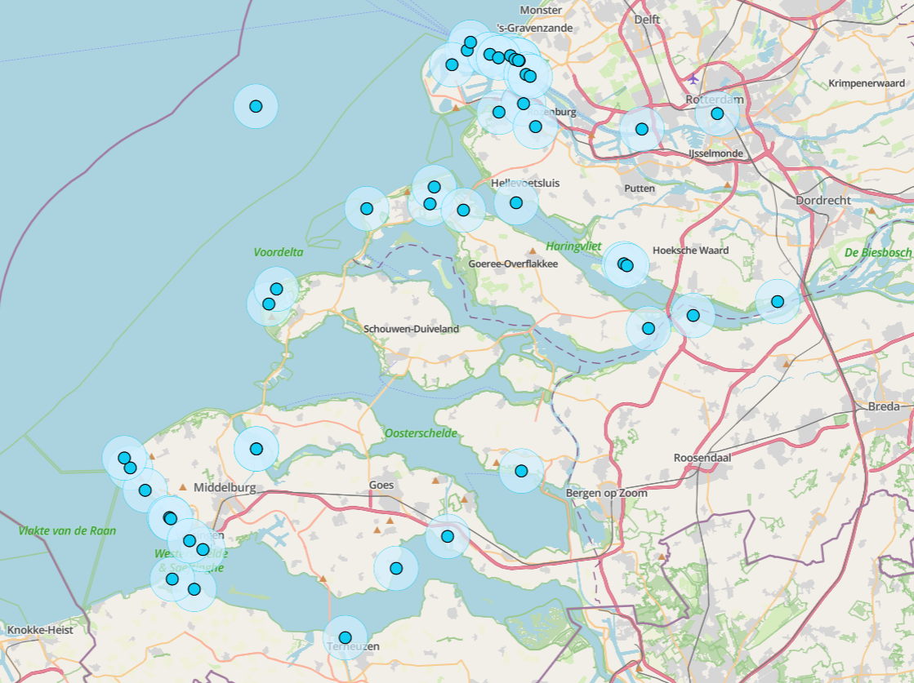
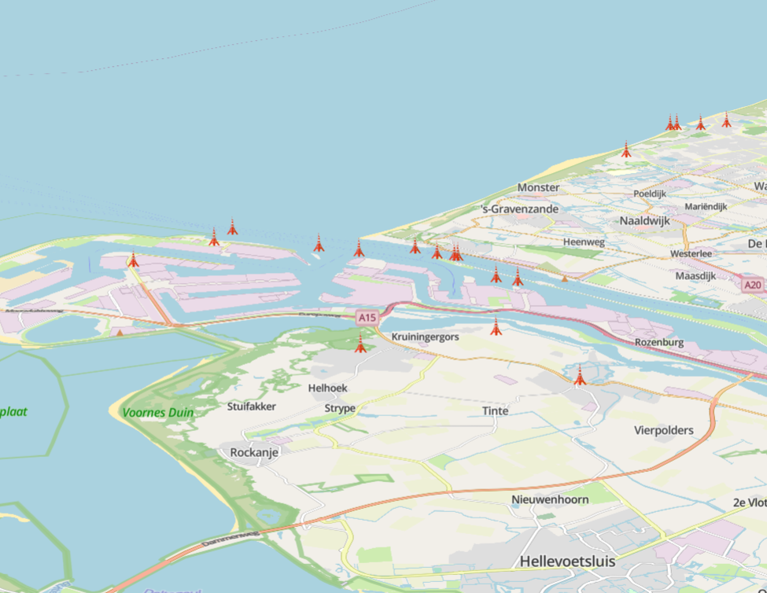
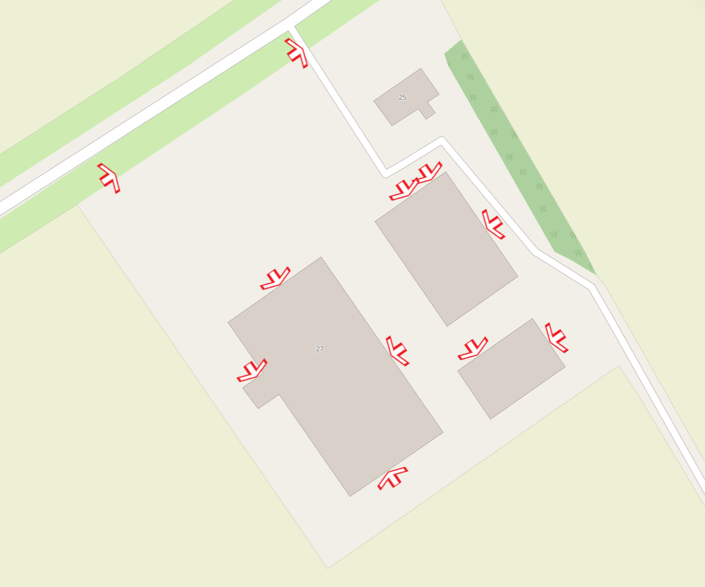
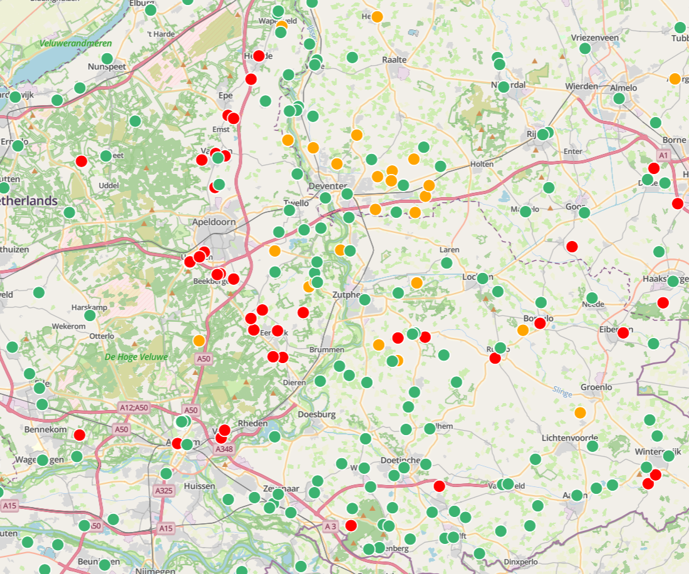

# {{ config.site_name }}

Punten
---
Voor deze handleiding over de styling van punten is gebruik gemaakt van de dataset [Molens](https://nationaalgeoregister.nl/geonetwork/srv/dut/catalog.search#/metadata/291afe4b-4f4b-497c-8026-fb437c4e9c7e), [Vuurtorens](https://www.nationaalgeoregister.nl/geonetwork/srv/api/records/559aec8c-a2e3-472a-9de0-3a4bd365c46d?language=all) en ROI voorzieningen.
Aan de hand van deze dataset zullen enkele voorbeelden gegeven worden van de stylingsmogelijkheden. Alle simpele styling voorbeelden zijn onderdeel van de ["Genereer style”](../index.md/#style-genereren) functie in MapGallery. Vervolgens worden de [geavanceerde stylingopties](#geavanceerde-styling) besproken.

Simpele styling 
---

### Simpele punt
```json
 {
  "name": "",
  "rules": [
    {
      "name": "Molens",
      "filter": ["==", "$type", "Point"],
      "symbolizers": [
        {
          "kind": "Mark",
          "color": "#12cdf3",
          "radius": 7,
          "strokeColor": "black",
          "strokeWidth": 2,
          "strokeOpacity": 1,
          "wellKnownName": "circle"
        }
      ]
    }
  ]
}
```


Dit voorbeeld is opgesteld met de knop "Genereer style". Binnen rules zijn de opmaakregels beschreven. In de filter is gekozen voor alle geometrieën van het type `Point`.

- Het type symbool is `Mark`, oftewel een markering op de kaart (een punt).
- De kleur #12cdf3 is weergegeven in hex-notatie. Naast een hexcode kunnen ook andere kleurnotaties worden gebruikt, zoals RGB, RGBA, HSL, HSLA, of een van de 140 vooraf gedefinieerde [HTML-kleuren](https://www.w3schools.com/colors/colors_names.asp) (bijvoorbeeld yellow, darkblue of tomato).
- De grootte (`radius`) bedraagt op dit moment 7 pixels.
- De `strokeColor` bepaalt de kleur van de omlijning, die in dit geval zwart is. Hiervoor kunnen dezelfde kleurnotaties worden toegepast als bij de vulling van het punt.
- De `strokeWidth` bepaalt de dikte van de omlijning.
- De `strokeOpacity` bepaalt de transparantie van de omlijning.
- Met `wellKnownName` wordt de vorm van het symbool vastgelegd. In dit geval betreft het een cirkel.

### Punt als afbeelding
```json
{
  "name": "",
  "rules": [
    {
      "name": "Molens",
      "filter": ["==", "$type", "Point"],
      "symbolizers": [
        {
          "kind": "Icon",
          "size": 7,
          "image": "https://upload.wikimedia.org/wikipedia/commons/8/81/Windmill_-_Delapouite_-_game-icons.svg",
          "sizeUnit": "m",
          "allowOverlap": true
        }
      ]
    }
  ]
}
```

  
Dit voorbeeld is opgesteld met de knop "Genereer style". Het is naast een simpele punt ook mogelijk een zelfgekozen afbeelding te gebruiken om punten weer te geven met het symbooltype Icon.

- `kind` is in plaats van `Mark`, nu `Icon`.
- Bij `image` wordt de URL van de gewenste afbeelding opgegeven. Dit moet een directe link zijn die eindigt op het bestandsformaat, zoals .jpg, .svg of .png. Een betrouwbare bron voor geschikte afbeeldingen is bijvoorbeeld [Wikimedia Commons](https://commons.wikimedia.org/wiki/Category:Images).
- De optie `allowOverlap` bepaalt of de afbeeldingen elkaar mogen overlappen.
    - Wanneer overlappen niet is toegestaan (`false`), worden symbolen pas zichtbaar bij verder inzoomen op de kaart.
    - Wanneer overlappen wel is toegestaan (`true`), kunnen symbolen gedeeltelijk of volledig bedekt worden door andere symbolen.


### Styling op categorie 
```json
{
  "name": "",
  "rules": [
    {
      "name": "Industriemolen",
      "filter": ["==", "HFDFUNCTIE", "industriemolen"],
      "symbolizers": [
        {
          "kind": "Mark",
          "color": "#e07a5f",
          "radius": 9,
          "strokeColor": "black",
          "strokeWidth": 2,
          "strokeOpacity": 1,
          "wellKnownName": "circle"
        }
      ]
    },
    {
      "name": "Koren-/industriemolen",
      "filter": ["==", "HFDFUNCTIE", "koren-/industriemolen"],
      "symbolizers": [
        {
          "kind": "Mark",
          "color": "#f2cc8f",
          "radius": 9,
          "strokeColor": "black",
          "strokeWidth": 2,
          "strokeOpacity": 1,
          "wellKnownName": "circle"
        }
      ]
    },
    {
      "name": "Koren-/zaagmolen",
      "filter": ["==", "HFDFUNCTIE", "koren-/zaagmolen"],
      "symbolizers": [
        {
          "kind": "Mark",
          "color": "#81b29a",
          "radius": 9,
          "strokeColor": "black",
          "strokeWidth": 2,
          "strokeOpacity": 1,
          "wellKnownName": "circle"
        }
      ]
    }
  ]
}
```


Dit voorbeeld is opgesteld met de knop "Genereer style". Het is mogelijk om aparte symbolen te genereren voor verschillende categorieën. In dit voorbeeld is gekozen voor een styling op het veld `"HFDFUNCTIE"`. Het gewenste veld kan worden geselecteerd door “Weergave op categorie” te kiezen binnen de functie "Genereer stijl". Qua code verschilt dit nauwelijks van eerdere voorbeelden. Het verschil is dat de code nu bestaat uit verschillende blokken, elk met een andere filterwaarde voor het veld `"HFDFUNCTIE"`.

Let op: het bovenstaande voorbeeldcode toont alleen de eerste drie typen uit de categorie.

!!! Info 

    Als er geen velden zichtbaar zijn in het dropdownmenu van “Categorie veld”, controleer dan of in het tabblad “Velden” de optie “Aanpassen van velden” is aangevinkt.

### Punten met labels 
```json
{
  "name": "",
  "rules": [
    {
      "name": "Molens",
      "filter": ["==", "$type", "Point"],
      "symbolizers": [
        {
          "kind": "Mark",
          "color": "#12cdf3",
          "radius": 7,
          "strokeColor": "black",
          "strokeWidth": 2,
          "strokeOpacity": 1,
          "wellKnownName": "circle"
        }
      ]
    },
    {
      "name": "TYPE",
      "symbolizers": [
        {
          "kind": "Text",
          "size": 12,
          "color": "#111111",
          "label": { "args": ["TYPE"], "name": "property" },
          "offset": [0, 2],
          "haloColor": "#FFFFFF",
          "haloWidth": 1
        }
      ]
    }
  ]
}
```


Dit voorbeeld is opgesteld met de knop "Genereer style". Naast het gebruik van symbolen kan ook informatie worden weergegeven met labels. In dit voorbeeld wordt `"TYPE"` gebruikt als inhoud van de labels.

- `name` bepaalt de naam van het label in de legenda. Deze kan naar wens worden aangepast.
- `size` en `color` kunnen, net als bij een simpele punt, vrij worden aangepast.
- Bij `args` wordt het veld opgegeven dat de labeltekst bevat, in dit geval `"TYPE"`.
- Onder `offset` wordt de afstand van het label tot het punt ingesteld. Dit zijn [x, y] coördinaten. Positieve waarden geven rechts en omlaag aan, terwijl negatieve waarden links en omhoog aangeven.
- Labels kunnen een omlijning of gloed hebben. De kleur en dikte daarvan worden bepaald met `haloColor` en `haloWidth`.

Geavanceerde styling
---
### Geavanceerde labels
```json
{
  "name": "",
  "rules": [
    {
      "name": "PDOK - Molens",
      "filter": ["==", "$type", "Point"],
      "symbolizers": [
        {
          "kind": "Mark",
          "color": "#5904c8",
          "radius": 7,
          "strokeColor": "gray",
          "strokeWidth": 2,
          "strokeOpacity": 1,
          "wellKnownName": "circle"
        }
      ]
    },
    {
      "name": "HFDFUNCTIE",
      "symbolizers": [
        {
          "font": ["georgia"],
          "kind": "Text",
          "size": 12,
          "color": "#000000",
          "label": { "args": ["HFDFUNCTIE"], "name": "property" },
          "offset": [4, 0],
          "rotate": -25,
          "opacity": 1,
          "haloColor": "#FFFFFF",
          "haloWidth": 1,
          "allowOverlap": true
        }
      ]
    }
  ]
}
```


Deze labels zijn geavanceerder en bieden meer mogelijkheden voor persoonlijke voorkeur. Een groot deel van de instellingen komt overeen met de eenvoudige labelstyling. Hieronder worden de verschillende opties toegelicht:

-  Door een `font` te kiezen wordt het lettertype van het label aangepast. De volgende lettertypen worden ondersteund:
    <ul>
    <li style="font-family: Arial;">Arial</li>
    <li style="font-family: Verdana;">Verdana</li>
    <li style="font-family: Sans-serif;">Sans-serif</li>
    <li style="font-family: 'Courier New';">Courier New</li>
     <li style="font-family: 'Lucida Console';">Lucida Console</li>
     <li style="font-family: Monospace;">Monospace</li>
     <li style="font-family: 'Times New Roman';">Times New Roman</li>
     <li style="font-family: Georgia;">Georgia</li>
     <li style="font-family: Serif;">Serif</li>
    </ul>

- `rotate` bepaalt de hoek waarin de tekst wordt weergegeven.
    - De waarde 0 betekent dat de tekst horizontaal blijft staan.
    - Een waarde rond 100 resulteert in een verticale plaatsing.
    - Ook negatieve waarden zijn mogelijk, waarmee de tekst de andere kant op helt.
- `opacity` bepaalt de transparantie van het label.
    - Een waarde van 1 betekent volledig zichtbaar.
    - Een waarde van 0 maakt het label volledig onzichtbaar.
- `allowOverlap` bepaalt of labels elkaar mogen overlappen.
    - Wanneer overlappen niet is toegestaan (`false`), verschijnen labels pas bij verder inzoomen op de kaart.
    - Wanneer overlappen wel is toegestaan (`true`), kunnen labels gedeeltelijk of volledig overlapt worden door andere labels.
- Onder `offset` wordt de afstand van het label tot het punt ingesteld. Dit zijn [x, y] coördinaten. Positieve waarden geven rechts en omlaag aan, terwijl negatieve waarden links en omhoog aangeven.

### Atribute-based punten
```json
{
  "name": "Jaar van ingebruikstelling",
  "rules": [
    {
      "name": "Voor 1960",
      "filter": ["<", "jaar_van_ingebruikstelling", 1960],
      "symbolizers": [
        {
          "kind": "Mark",
          "color": "#66CCFF",
          "radius": 4,
          "stroke": "#000000",
          "strokeWidth": 1,
          "wellKnownName": "circle"
        }
      ]
    },
    {
      "name": "Tussen 1960 en 1990",
      "filter": [
        "&&",
        [">=", "jaar_van_ingebruikstelling", 1960],
        ["<", "jaar_van_ingebruikstelling", 1990]
      ],
      "symbolizers": [
        {
          "kind": "Mark",
          "color": "#3399FF",
          "radius": 6,
          "stroke": "#000000",
          "strokeWidth": 1,
          "wellKnownName": "circle"
        }
      ]
    },
    {
      "name": "Na 1990",
      "filter": [">=", "jaar_van_ingebruikstelling", 1990],
      "symbolizers": [
        {
          "kind": "Mark",
          "color": "#0033CC",
          "radius": 8,
          "stroke": "#000000",
          "strokeWidth": 1,
          "wellKnownName": "circle"
        }
      ]
    }
  ]
}
```


Deze stijl bepaalt hoe punten op de kaart worden weergegeven op basis van het jaartal van het veld: `“jaar_van_ingebruikstelling”`. Hoe hoger het jaartal van de ingebruikstelling van de vuurtoren, hoe groter het punt. 

- Voor 1960 → kleine lichtblauwe cirkels (`radius: 4`).
    - `["<", "jaar_van_ingebruikstelling", 1960]`
- 1960–1990 → middelgrote blauwe cirkels (`radius: 6`).
    - `["&&",[">=", "jaar_van_ingebruikstelling", 1960],["<", "jaar_van_ingebruikstelling", 1990]]`
- Na 1990 → grote donkerblauwe cirkels (`radius: 8`).
    - `[">=", "jaar_van_ingebruikstelling", 1990]`

!!! question "Meer info"

    Voor meer informatie over de verschillende mogelijkheden van filteren, zie de pagina over [geavgeavanceerde filtering](../filtering/index.md).

!!! warning

    Let op: deze stijl kan alleen worden toegepast als het datatype van het veld numeriek (number) is. Wanneer het veld een ander datatype heeft, werkt deze vorm van styling niet.

 

### Zoom-based punten
```json
{
  "rules": [
    {
      "name": "Groot",
      "symbolizers": [
        {
          "kind": "Mark",
          "color": "#CC3300",
          "radius": 6,
          "wellKnownName": "circle"
        }
      ],
      "scaleDenominator": { "max": 100000 }
    },
    {
      "name": "Middel",
      "symbolizers": [
        {
          "kind": "Mark",
          "color": "#CC3300",
          "radius": 4,
          "wellKnownName": "circle"
        }
      ],
      "scaleDenominator": { "max": 1000000, "min": 100000 }
    },
    {
      "name": "Klein",
      "symbolizers": [
        {
          "kind": "Mark",
          "color": "#CC3300",
          "radius": 2,
          "wellKnownName": "circle"
        }
      ],
      "scaleDenominator": { "min": 1000000 }
    }
  ]
}
```

| Schaalniveau | Bereik | Afbeelding |
| ------------- | ------- | ----------- |
| Klein  | Vanaf 1 000 000 |  |
| Middel | 100 000 – 1 000 000 |  |
| Groot  | Tot 100 000 |  |

Met deze styling wordt de weergave van punten afhankelijk gemaakt van de schaal. In dit voorbeeld verandert de grootte van het punt op basis van het zoomniveau. Dit gedrag wordt geregeld met de `scaleDenominator`, waarin een minimale en/of maximale waarde kan worden opgegeven.

- `"scaleDenominator": { "max": 100000 }`: De stijl is zichtbaar tot een schaal van 1:100.000, dus wanneer je dichterbij bent (meer ingezoomd).
- `"scaleDenominator": { "min": 50000 }`: De stijl wordt zichtbaar vanaf een schaal van 1:50.000, dus wanneer je verder uitzoomt.

Op deze manier kan de kaart verschillende weergaven tonen op verschillende zoomniveaus, wat zorgt voor een overzichtelijke en schaalafhankelijke visualisatie. Dit voorbeeld kan ook goed worden gecombineerd met andere voorbeelden uit dit kookboek: bij een hoge schaal kan een icoon als marker dienen, terwijl dit bij uitzoomen verandert in een eenvoudig punt.

### Zichtbaar bij bepaald niveau
```json
{
  "rules": [
    {
      "name": "Molens",
      "symbolizers": [
        {
          "kind": "Mark",
          "color": "#CC3300",
          "radius": 7,
          "wellKnownName": "circle"
        }
      ],
      "scaleDenominator": { "max": 1000000 }
    }
  ]
}
```


Wanneer er veel punten op de kaart staan, is het niet altijd wenselijk om deze op alle schaalniveaus zichtbaar te houden. Het kan overzichtelijker zijn om ze pas te tonen vanaf een bepaald zoomniveau. In dit voorbeeld worden de punten alleen weergegeven bij een schaal kleiner dan 1:1.000.000. Dat is ingesteld met de eigenschap: `"scaleDenominator": { "max": 1000000 }`.

Hierdoor zijn de punten zichtbaar wanneer verder wordt ingezoomd, maar verdwijnen ze automatisch bij het uitzoomen naar 1:1.000.000 of kleiner detailniveau. Op deze manier blijft de kaart overzichtelijk en worden te veel overlappende symbolen op grote schaalniveaus voorkomen.

### Transparant punt
```json
{
  "name": "",
  "rules": [
    {
      "name": "Molens",
      "filter": ["==", "$type", "Point"],
      "symbolizers": [
        {
          "kind": "Mark",
          "color": "olive",
          "radius": 6,
          "opacity": 0.7,
          "strokeColor": "black",
          "strokeWidth": 1,
          "strokeOpacity": 0.8,
          "wellKnownName": "circle"
        }
      ]
    }
  ]
}
```


Door de waarde van de eigenschap `opacity` aan te passen, kun je de doorzichtigheid van een punt bepalen. Bij een waarde van 1 is het punt volledig ondoorzichtig, terwijl een waarde van 0 het punt volledig transparant maakt. Met een waarde van 0.5 is het punt half doorzichtig, zodat onderliggende objecten gedeeltelijk zichtbaar blijven.

Door de eigenschap `strokeOpacity` aan te passen, kun je op dezelfde manier de doorzichtigheid van de omlijning van het punt regelen. Deze instelling heeft dus invloed op de rand, niet op de vulling van het punt.

### Punt met buffer
```json
{
  "rules": [
    {
      "name": "Buffer",
      "symbolizers": [
        {
          "kind": "Mark",
          "color": "#cfeefe",
          "radius": 23,
          "opacity": 0.7,
          "strokeColor": "#12cdf3",
          "strokeWidth": 0.5,
          "strokeOpacity": 0.8,
          "wellKnownName": "circle"
        }
      ]
    },
    {
      "name": "Punt",
      "symbolizers": [
        {
          "kind": "Mark",
          "color": "#12cdf3",
          "radius": 6,
          "opacity": 1,
          "strokeColor": "#000000",
          "strokeWidth": 1,
          "wellKnownName": "circle"
        }
      ]
    }
  ]
}

```


Om een buffer rond een punt weer te geven, wordt een extra, grotere cirkel achter het oorspronkelijke punt geplaatst. Deze grotere cirkel fungeert als visuele buffer en kan bijvoorbeeld half transparant worden gemaakt door de `opacity` aan te passen.


### Eigen icoon toevoegen
```json
{
  "name": "",
  "rules": [
    {
      "name": "PDOK - Molens",
      "filter": ["==", "$type", "Point"],
      "symbolizers": [
        {
          "kind": "Icon",
          "size": 7,
          "image": "https://pics.freeicons.io/uploads/icons/png/67939692616269555413314-512.png",
          "sizeUnit": "m",
          "allowOverlap": true
        }
      ]
    }
  ]
}
```

<div style="display: flex; justify-content: center; gap: 10px;">
  
  
</div>


Het is ook mogelijk om een eigen icoon te gebruiken of een symbool van een andere website te gebruiken. Om een afbeelding te gebruiken van een externe bron (anders dan Wikimedia Commons), moet de betreffende website eerst worden toegevoegd. Anders kan de afbeelding niet worden geladen.

In dit voorbeeld wordt de [Tokyo Tower](https://images.emojiterra.com/google/noto-emoji/unicode-16.0/color/svg/1f5fc.svg) emoji gebruikt van de website [EmojiTerra](https://emojiterra.com)

- Ga naar de services en druk op de knop "toevoegen" op een service toetevoegen:
    - URL: https://images.emojiterra.com/
    - Protocol: HTTP - Assets web URL
- Ga naar style van de kaartlaag:
    - Bij `image` wordt de URL van de gewenste afbeelding opgegeven. Dit moet een directe link zijn die eindigt op het bestandsformaat, zoals .jpg, .svg of .png. In dit voorbeeld is dit: [Tokyo Tower](https://images.emojiterra.com/google/noto-emoji/unicode-16.0/color/svg/1f5fc.svg).
- - `kind` is in plaats van `Mark` nu `Icon`.
- De optie `allowOverlap` bepaalt of de afbeeldingen elkaar mogen overlappen:
    - Wanneer overlappen niet is toegestaan (`false`), worden symbolen pas zichtbaar bij verder inzoomen op de kaart.
    - Wanneer overlappen wel is toegestaan (`true`), kunnen symbolen gedeeltelijk of volledig bedekt worden door andere symbolen.

!!! warning 

    Let op: Sommige websites blokkeren het gebruik van hun afbeeldingen buiten hun eigen domein. Daardoor worden de afbeeldingen niet weergegeven, ook niet als de website is toegevoegd aan de services in MapGallery. Dit komt doordat de website het extern laden van bestanden beperkt om ongewenst gebruik te voorkomen.


### Rotatie op basis van data
```json
{
  "name": "",
  "rules": [
    {
      "name": "Voorziening",
      "symbolizers": [
        {
          "kind": "Icon",
          "size": 14,
          "image": "https://imroi.github.io/kaartsymbolen/iconen/voorziening/{symbool_id}.svg",
          "rotate": { "args": ["rotatie"], "name": "property" },
          "sizeUnit": "m",
          "allowOverlap": true,
          "defaultImage": "https://imroi.github.io/kaartsymbolen/iconen/voorziening/172.svg"
        }
      ]
    }
  ]
}
```


In MapGallery kunnen waarden uit de dataset worden gebruikt om de stijl aan te passen. In dit voorbeeld wordt het veld `rotatie` gebruikt om de draaiing van een symbool te bepalen.

De regel `"rotate": { "args": ["rotatie"], "name": "property" }` geeft aan dat de rotatiehoek van elk object wordt opgehaald uit het veld `rotatie` in de dataset. MapGallery gebruikt deze waarde om elk icoon individueel te roteren, bijvoorbeeld om pijlen of symbolen in de juiste richting te laten wijzen.

!!! warning

    Let op: deze stijl kan alleen worden toegepast als het datatype van het veld numeriek (number) is. Wanneer het veld een ander datatype heeft, werkt deze vorm van styling niet.


### Afbeelding op basis van data
```json
{
  "name": "",
  "rules": [
    {
      "name": "Voorziening",
      "symbolizers": [
        {
          "kind": "Icon",
          "size": 14,
          "image": "https://imroi.github.io/kaartsymbolen/iconen/voorziening/{symbool_id}.svg",
          "rotate": { "args": ["rotatie"], "name": "property" },
          "sizeUnit": "m",
          "allowOverlap": true,
          "defaultImage": "https://imroi.github.io/kaartsymbolen/iconen/voorziening/172.svg"
        }
      ]
    }
  ]
}
```


In MapGallery kun je ook dynamisch afbeeldingen gebruiken op basis van waarden in de dataset. In dit voorbeeld wordt bij `image` een link opgegeven naar een svg-bestand, waarin `{symbool_id}` een variabele is.

Tijdens het laden van de kaart wordt `{symbool_id}` automatisch vervangen door de waarde uit het veld `symbool_id` van elk object. Zo krijgt elk punt het juiste icoon. De parameter `defaultImage` wordt gebruikt als er voor een object geen geldige symbool_id-waarde is, zodat er altijd een symbool zichtbaar blijft. 


!!! warning

    Let op: deze stijl kan alleen worden toegepast als er een symbool 


### Kleur op basis van data 
```json
{
  "name": "",
  "rules": [
    {
      "filter": ["==", "$type", "Point"],
      "symbolizers": [
        {
          "kind": "Mark",
          "color": { "name": "property", "args": ["kleurcode"] },
          "radius": 7,
          "strokeColor": "black",
          "strokeWidth": 2,
          "strokeOpacity": 1,
          "wellKnownName": "circle"
        }
      ]
    }
  ]
}
```


In MapGallery kun je ook kleuren dynamisch instellen op basis van waarden in de dataset. Dit maakt het mogelijk om objecten automatisch een kleur te geven die direct uit een veld in de data komt, zonder dat je voor elke categorie een aparte regel hoeft te maken.

In dit voorbeeld wordt het veld `kleurcode` gebruikt om de kleur van elk punt te bepalen. De regel `"color": { "name": "property", "args": ["kleurcode"] }` geeft aan dat de waarde uit het veld `kleurcode` wordt opgehaald en toegepast als vulkleur van het symbool.

De dataset moet hiervoor geldige kleurwaarden bevatten, bijvoorbeeld in [HTML-formaat](https://www.w3schools.com/colors/colors_names.asp) ("red", "orange", "red") of hex-notitie ("#ff0000", "#00ffcc"). 


