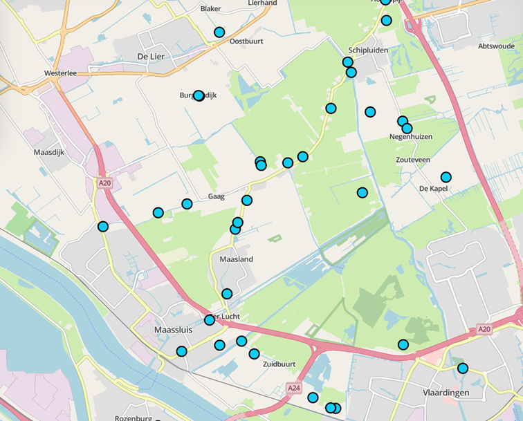

# {{ config.site_name }}

Punten
---
Voor de handleiding over de styling van punten is gebruik gemaakt van de [dataset molens](https://nationaalgeoregister.nl/geonetwork/srv/dut/catalog.search#/metadata/291afe4b-4f4b-497c-8026-fb437c4e9c7e). Deze is te vinden in o.a. het nationaal georegister van PDOK.
Aan de hand van deze dataset zullen enkele voorbeelden gegeven worden van de stylingsmogelijkheden. Alle voorbeelden zijn onderdeel van de “genereer style” functie in MapGallery.
### Simpele punt

```
 {
  "name": "",
  "rules": [
    {
      "name": "Molens",
      "filter": ["==", "$type", "Point"],
      "symbolizers": [
        {
          "kind": "Mark",
          "color": "#12cdf3",
          "radius": 7,
          "strokeColor": "black",
          "strokeWidth": 2,
          "strokeOpacity": 1,
          "wellKnownName": "circle"
        }
      ]
    }
  ]
}
```


De code hierboven is het resultaat van het genereren van een eenvoudige punt weergave in MapGallery. Binnen __rules__ zijn de stylingsregels beschreven. In de __filter__ is gekozen voor alle geometrieën van het type punt.

- Het type symbool is __mark__, ofwel een markering op de kaart. 
- De __kleur__ "#12cdf3" in hex notatie, de code begint met # gevolgd door 6 tekens, bestaande uit drie paren, die respectievelijk de intensiteit van rood, groen en blauw (RGB) weergeven. Maar de basiskleuren worden ook herkend zoals red, green, indigo ect. 
-	De grootte ofwel __radius__ is op het moment 7 pixels.
-	De __strokeColor__, ofwel de omlijning is zwart. Hierbij kan je gebruik maken van de zelfde kleur opties als bij de kleur van de punt. 
-	De __strokeWidth__ bepaald de dikte van de omlijning.
-	De __strokeOpacity__ bepaald de transparantie van het punt.
-	Bij __wellKnownName__ wordt de vorm van het symbool bepaald, in dit geval een cirkel. Alternatieven hiervan zijn bijvoorbeeld square of triangle, maar op het moment wordt cirkel ondersteund.   

### Afbeelding als symbool
```
{
  "name": "",
  "rules": [
    {
      "name": "Molens",
      "filter": ["==", "$type", "Point"],
      "symbolizers": [
        {
          "kind": "Icon",
          "size": 7,
          "image": "https://upload.wikimedia.org/wikipedia/commons/8/81/Windmill_-_Delapouite_-_game-icons.svg",
          "sizeUnit": "m",
          "allowOverlap": true
        }
      ]
    }
  ]
}
```

Het is ook mogelijk een zelfgekozen afbeelding te gebruiken om de punten weer te geven met het symbooltype __icon__.  

-	Bij __image__ moet in dit geval de url van de gewenste afbeelding geplaatst worden. Let op dat het een directe link naar de afbeelding is, eindigend op het bestandsformat zoals .jpg/.svg/.png. Een goede bron voor afbeeldingen is [Wikimedia](https://commons.wikimedia.org/wiki/Category:Images).
-	Met __allowOverlap__ bepaald men of de afbeelding mogen overlappen. Zoniet, dan worden ze pas allemaal zichtbaar bij het verder inzoomen van de kaart. Zowel, zijn niet alle symbolen zichtbaar als ze overlappen.  

### Punten met labels 
```
{
  "name": "",
  "rules": [
    {
      "name": "Molens",
      "filter": ["==", "$type", "Point"],
      "symbolizers": [
        {
          "kind": "Mark",
          "color": "#12cdf3",
          "radius": 7,
          "strokeColor": "black",
          "strokeWidth": 2,
          "strokeOpacity": 1,
          "wellKnownName": "circle"
        }
      ]
    },
    {
      "name": "TYPE",
      "symbolizers": [
        {
          "kind": "Text",
          "size": 12,
          "color": "#111111",
          "label": { "args": ["TYPE"], "name": "property" },
          "offset": [0, 2],
          "haloColor": "#FFFFFF",
          "haloWidth": 1
        }
      ]
    }
  ]
}
```


Naast het gebruik van symbolen kan er ook informatie weergeven worden met labels. Hier is gekozen voor gebruik van het veld “Type” voor de inhoud van de labels. 

-	De __name__ bepaald hoe het label heet in de legenda, dit kan naar smaak aangepast worden. 
-	__Size__ en __color__ kunnen net als bij symbolen aangepast worden.
-	Bij __“args”__, na __label__: word het veld opgegeven voor de inhoud van de labels, in dit geval [“TYPE”]
-	Onder __offset__ word de afstand het label tot het punt bepaald.
-	De labels hebben ook een omlijning of zogeheten gloed, de kleur en grootte hiervan word bepaald met __haloColor__ en __haloWidth__.


### Syling op categorie 
```
{
  "name": "",
  "rules": [
    {
      "name": "Industriemolen",
      "filter": ["==", "HFDFUNCTIE", "industriemolen"],
      "symbolizers": [
        {
          "kind": "Mark",
          "color": "#779e78",
          "radius": 7,
          "strokeColor": "black",
          "strokeWidth": 2,
          "strokeOpacity": 1,
          "wellKnownName": "circle"
        }
      ]
    },
    {
      "name": "Koren-/industriemolen",
      "filter": ["==", "HFDFUNCTIE", "koren-/industriemolen"],
      "symbolizers": [
        {
          "kind": "Mark",
          "color": "#594466",
          "radius": 7,
          "strokeColor": "white",
          "strokeWidth": 2,
          "strokeOpacity": 1,
          "wellKnownName": "circle"
        }
      ]
    },
    {
      "name": "Koren-/zaagmolen",
      "filter": ["==", "HFDFUNCTIE", "koren-/zaagmolen"],
      "symbolizers": [
        {
          "kind": "Mark",
          "color": "#c829dc",
          "radius": 7,
          "strokeColor": "white",
          "strokeWidth": 2,
          "strokeOpacity": 1,
          "wellKnownName": "circle"
        }
      ]
    }
  ]
}

```


Het is mogelijk om aparte symbolen te genereren voor verschillende categorieën. Binnen molens is in dit voorbeeld gekozen voor styling op het veld HFDFUNCTIE. Het gewenste veld kan geselecteerd worden wanneer men “Weergave op categorie” selecteert binnen het de genereer style functie. 
Qua code verschilt er niet veel met voorgaande voorbeelden, behalve dat deze dan uit opeenvolgende blokken bestaat met een verschillende filterwaarde voor het veld HFDFUNCTIE. Let op, de voorbeeldcode beslaat alleen de eerste 3 types van de categorie.
