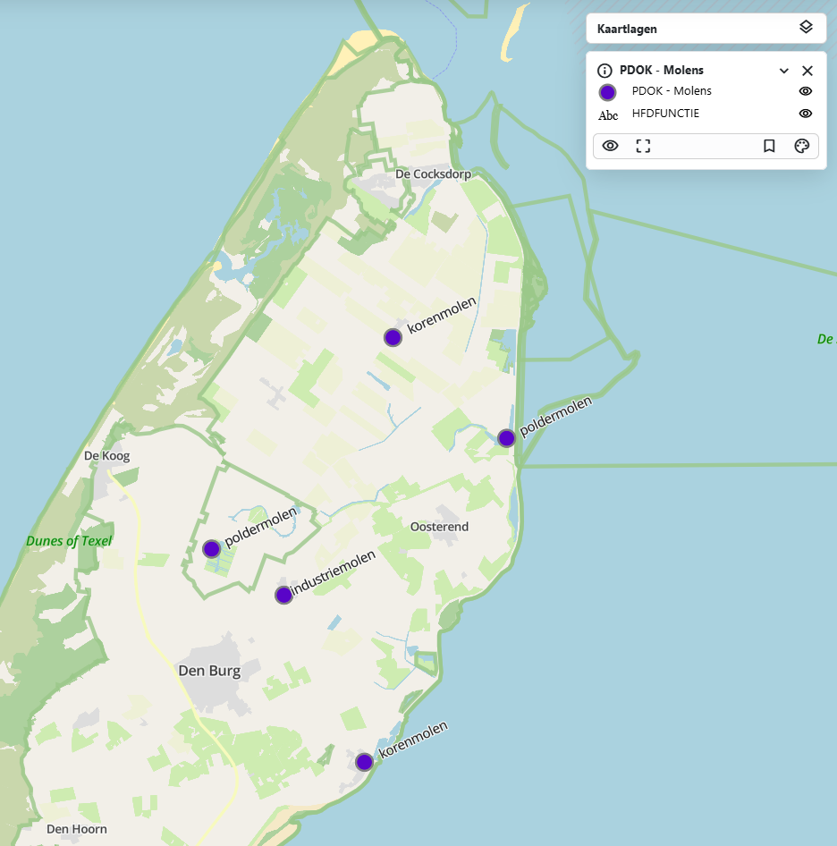

# {{ config.site_name }}

Punten
---
Voor deze handleiding over de styling van punten is gebruik gemaakt van de [dataset molens](https://nationaalgeoregister.nl/geonetwork/srv/dut/catalog.search#/metadata/291afe4b-4f4b-497c-8026-fb437c4e9c7e). Deze is te vinden in o.a. het nationaal georegister van PDOK.
Aan de hand van deze dataset zullen enkele voorbeelden gegeven worden van de stylingsmogelijkheden. Alle simpele styling voorbeelden zijn onderdeel van de “genereer style” functie in MapGallery. Vervolgens worden de [geavanceerde stylingopties](#geavanceerde-styling) besproken.

Simpele styling 
---

### Simpele punt

```
 {
  "name": "",
  "rules": [
    {
      "name": "Molens",
      "filter": ["==", "$type", "Point"],
      "symbolizers": [
        {
          "kind": "Mark",
          "color": "#12cdf3",
          "radius": 7,
          "strokeColor": "black",
          "strokeWidth": 2,
          "strokeOpacity": 1,
          "wellKnownName": "circle"
        }
      ]
    }
  ]
}
```


De code hierboven is het resultaat van het genereren van een eenvoudige punt weergave in MapGallery. Binnen rules zijn de stylingsregels beschreven. In de filter is gekozen voor alle geometrieën van het type "Point".

- Het type symbool is "Mark", ofwel een markering op de kaart. 
- De kleur #12cdf3 in hex notatie, de code begint met # gevolgd door 6 tekens, bestaande uit drie paren, die respectievelijk de intensiteit van rood, groen en blauw (RGB) weergeven. Maar de basiskleuren worden ook herkend zoals red, green, indigo ect. 
-	De grootte ofwel radius is op het moment 7 pixels.
-	De strokeColor, ofwel de omlijning is zwart. Hierbij kan je gebruik maken van de zelfde kleur opties als bij de kleur van de punt. 
-	De strokeWidth bepaald de dikte van de omlijning.
-	De strokeOpacity bepaald de transparantie van het punt.
-	Bij wellKnownName wordt de vorm van het symbool bepaald, in dit geval een cirkel. Alternatieven hiervan zijn bijvoorbeeld square of triangle, maar op het moment wordt alleen de cirkel ondersteund.   

### Afbeelding als symbool
```
{
  "name": "",
  "rules": [
    {
      "name": "Molens",
      "filter": ["==", "$type", "Point"],
      "symbolizers": [
        {
          "kind": "Icon",
          "size": 7,
          "image": "https://upload.wikimedia.org/wikipedia/commons/8/81/Windmill_-_Delapouite_-_game-icons.svg",
          "sizeUnit": "m",
          "allowOverlap": true
        }
      ]
    }
  ]
}
```

Het is ook mogelijk een zelfgekozen afbeelding te gebruiken om de punten weer te geven met het symbooltype icon.  

-	Bij image moet in dit geval de url van de gewenste afbeelding geplaatst worden. Let op dat het een directe link naar de afbeelding is, eindigend op het bestandsformat zoals .jpg/.svg/.png. Een goede bron voor afbeeldingen is [Wikimedia](https://commons.wikimedia.org/wiki/Category:Images).
-	De optie allowOverlap bepaalt of de afbeeldingen elkaar mogen overlappen. Als overlappen niet is toegestaan, verschijnen alle symbolen pas bij verder inzoomen op de kaart. Als overlappen wel is toegestaan, kunnen sommige symbolen onzichtbaar zijn doordat ze elkaar bedekken.

### Punten met labels 
```
{
  "name": "",
  "rules": [
    {
      "name": "Molens",
      "filter": ["==", "$type", "Point"],
      "symbolizers": [
        {
          "kind": "Mark",
          "color": "#12cdf3",
          "radius": 7,
          "strokeColor": "black",
          "strokeWidth": 2,
          "strokeOpacity": 1,
          "wellKnownName": "circle"
        }
      ]
    },
    {
      "name": "TYPE",
      "symbolizers": [
        {
          "kind": "Text",
          "size": 12,
          "color": "#111111",
          "label": { "args": ["TYPE"], "name": "property" },
          "offset": [0, 2],
          "haloColor": "#FFFFFF",
          "haloWidth": 1
        }
      ]
    }
  ]
}
```


Naast het gebruik van symbolen kan er ook informatie weergeven worden met labels. Hier is gekozen voor gebruik van het veld “TYPE” voor de inhoud van de labels. 

-	De name bepaald hoe het label heet in de legenda, dit kan naar smaak aangepast worden. 
-	Size en color kunnen net als bij symbolen aangepast worden.
-	Bij “args”, na label: word het veld opgegeven voor de inhoud van de labels, in dit geval [“TYPE”]
-	Onder offset word de afstand het label tot het punt bepaald.
-	De labels hebben ook een omlijning of zogeheten gloed, de kleur en grootte hiervan word bepaald met haloColor en haloWidth.


### Syling op categorie 
```
{
{
  "name": "",
  "rules": [
    {
      "name": "Industriemolen",
      "filter": ["==", "HFDFUNCTIE", "industriemolen"],
      "symbolizers": [
        {
          "kind": "Mark",
          "color": "#a21248",
          "radius": 7,
          "strokeColor": "black",
          "strokeWidth": 2,
          "strokeOpacity": 1,
          "wellKnownName": "circle"
        }
      ]
    },
    {
      "name": "Koren-/industriemolen",
      "filter": ["==", "HFDFUNCTIE", "koren-/industriemolen"],
      "symbolizers": [
        {
          "kind": "Mark",
          "color": "#3ec918",
          "radius": 7,
          "strokeColor": "black",
          "strokeWidth": 2,
          "strokeOpacity": 1,
          "wellKnownName": "circle"
        }
      ]
    },
    {
      "name": "Koren-/zaagmolen",
      "filter": ["==", "HFDFUNCTIE", "koren-/zaagmolen"],
      "symbolizers": [
        {
          "kind": "Mark",
          "color": "#511fbb",
          "radius": 7,
          "strokeColor": "black",
          "strokeWidth": 2,
          "strokeOpacity": 1,
          "wellKnownName": "circle"
      ]
    }
  ]
}
```


Het is mogelijk om aparte symbolen te genereren voor verschillende categorieën. Binnen de datasets molens is in dit voorbeeld gekozen voor styling op het veld "HFDFUNCTIE". Het gewenste veld kan geselecteerd worden wanneer men “Weergave op categorie” selecteert binnen het de genereer style functie. 
Qua code verschilt er niet veel met voorgaande voorbeelden, behalve dat deze dan uit opeenvolgende blokken bestaat met een verschillende filterwaarde voor het veld "HFDFUNCTIE". Let op, de voorbeeldcode beslaat alleen de eerste 3 types van de categorie.

!!! Note
    Als er geen velden staan onder het dropdown menu van 'Categorie veld'. Zorg dan dat bij het tabje “Velden” het aanpassen van velden is aangevinkt.

Geavanceerde styling
---
### Geavanceerde labels
```
{
  "name": "",
  "rules": [
    {
      "name": "PDOK - Molens",
      "filter": ["==", "$type", "Point"],
      "symbolizers": [
        {
          "kind": "Mark",
          "color": "#5904c8",
          "radius": 7,
          "strokeColor": "gray",
          "strokeWidth": 2,
          "strokeOpacity": 1,
          "wellKnownName": "circle"
        }
      ]
    },
    {
      "name": "HFDFUNCTIE",
      "symbolizers": [
        {
          "font": ["georgia"],
          "kind": "Text",
          "size": 12,
          "color": "#000000",
          "label": { "args": ["HFDFUNCTIE"], "name": "property" },
          "offset": [4, 0],
          "rotate": -25,
          "opacity": 1,
          "haloColor": "#FFFFFF",
          "haloWidth": 1,
          "allowOverlap": true
        }
      ]
    }
  ]
}
```


Deze labels zijn geavandeerder, met meer optie voor persoonlijke voorkeur. Een groot gedeelte komt overeen met de simpele styling van labels. Hieronder worden de verschillende mogelijkheden uitgelegd:

-  Door een font te kiezen wordt het lettertype van het label aangepast. Dit zijn de mogelijke lettertypes die worden ondersteund:
    <ul>
    <li style="font-family: Arial;">Arial</li>
    <li style="font-family: Verdana;">Verdana</li>
    <li style="font-family: Sans-serif;">Sans-serif</li>
    <li style="font-family: 'Courier New';">Courier New</li>
     <li style="font-family: 'Lucida Console';">Lucida Console</li>
     <li style="font-family: Monospace;">Monospace</li>
     <li style="font-family: 'Times New Roman';">Times New Roman</li>
     <li style="font-family: Georgia;">Georgia</li>
     <li style="font-family: Serif;">Serif</li>
    </ul>
- Rotate zorgt ervoor dat de tekst schuin staat. "0" betekend dat de tekst recht blijft, bij "100" staat de tekst verticaal. Negatieve getallen zijn ook mogelijk.  
- De opacity bepaald de transparantie/doorzichtigheid. "1" is normaal en "0" is onzichtbaar.
- De optie allowOverlap bepaalt of de labels elkaar mogen overlappen. Als overlappen niet is toegestaan, verschijnen alle labels pas bij verder inzoomen op de kaart. Als overlappen wel is toegestaan, kunnen sommige labels onzichtbaar zijn doordat ze elkaar bedekken.

### Atribute-based punten
```
{
  "name": "Jaar van ingebruikstelling",
  "rules": [
    {
      "name": "Voor 1960",
      "filter": ["<", "jaar_van_ingebruikstelling", 1960],
      "symbolizers": [
        {
          "kind": "Mark",
          "color": "#66CCFF",
          "radius": 4,
          "stroke": "#000000",
          "strokeWidth": 1,
          "wellKnownName": "circle"
        }
      ]
    },
    {
      "name": "Tussen 1960 en 1990",
      "filter": [
        "&&",
        [">=", "jaar_van_ingebruikstelling", 1960],
        ["<", "jaar_van_ingebruikstelling", 1990]
      ],
      "symbolizers": [
        {
          "kind": "Mark",
          "color": "#3399FF",
          "radius": 6,
          "stroke": "#000000",
          "strokeWidth": 1,
          "wellKnownName": "circle"
        }
      ]
    },
    {
      "name": "Na 1990",
      "filter": [">=", "jaar_van_ingebruikstelling", 1990],
      "symbolizers": [
        {
          "kind": "Mark",
          "color": "#0033CC",
          "radius": 8,
          "stroke": "#000000",
          "strokeWidth": 1,
          "wellKnownName": "circle"
        }
      ]
    }
  ]
}
```


Deze stijl definieert hoe punten op een kaart worden weergegeven op basis van het jaartal van "jaar_van_ingebruikstelling"

- Voor 1960 → kleine lichtblauwe cirkels (radius: 4).
    - ["<", "jaar_van_ingebruikstelling", 1960]
- 1960–1990 → middelgrote blauwe cirkels (radius: 6).
    - [">=", "jaar_van_ingebruikstelling", 1960],
        ["<", "jaar_van_ingebruikstelling", 1990]
- Na 1990 → grote donkerblauwe cirkels (radius: 8).
    - [">=", "jaar_van_ingebruikstelling", 1990]

Let op! Dit kan alleen worden gedaan als het datatype number is, anders kan deze styling niet. 

### Zoom-based punten
```
{
  "rules": [
    {
      "name": "Groot",
      "symbolizers": [
        {
          "kind": "Mark",
          "color": "#CC3300",
          "radius": 6,
          "wellKnownName": "circle"
        }
      ],
      "scaleDenominator": { "max": 100000 }
    },
    {
      "name": "Middel",
      "symbolizers": [
        {
          "kind": "Mark",
          "color": "#CC3300",
          "radius": 4,
          "wellKnownName": "circle"
        }
      ],
      "scaleDenominator": { "max": 1000000, "min": 100000 }
    },
    {
      "name": "Klein",
      "symbolizers": [
        {
          "kind": "Mark",
          "color": "#CC3300",
          "radius": 2,
          "wellKnownName": "circle"
        }
      ],
      "scaleDenominator": { "min": 1000000 }
    }
  ]
}
```

| Schaalniveau | Bereik | Afbeelding |
| ------------- | ------- | ----------- |
| Klein  | Vanaf 1 000 000 |  |
| Middel | 100 000 – 1 000 000 |  |
| Groot  | Tot 100 000 |  |

Met deze styling wordt de weergave van punten afhankelijk van de schaal aangepast. In dit voorbeeld verandert de grootte van het punt, en dit kan worden gestuurd met "scaleDenominator" door een min en/of max waarde te geven.

- "scaleDenominator": { "max": 100000 } betekent dat de stijl zichtbaar is bij een schaal van 1:100.000 of dichterbij (meer ingezoomd).
- "scaleDenominator": { "min": 50000 } betekent dat de stijl pas zichtbaar wordt bij een schaal van 1:50.000 of dichterbij.


