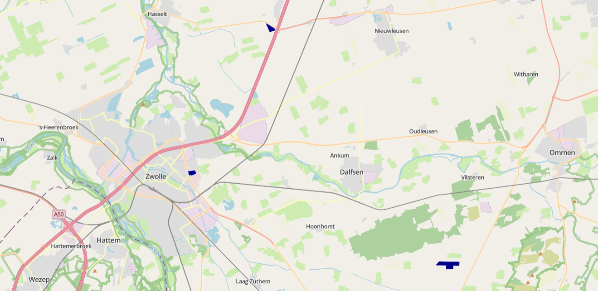

# {{ config.site_name }}

Vlakken
---
Voor deze handleiding over de styling van de vlakken is gebruik gemaakt van de dataset [Sluizen](https://www.nationaalgeoregister.nl/geonetwork/srv/api/records/ff62a030-bdd2-436a-9cea-8c83ccfa19f9?language=all), [Grenzen Omgevingsdiensten](https://www.nationaalgeoregister.nl/geonetwork/srv/api/records/6bda10cf-9648-4d17-af55-72fdf22193f6?language=all), [Luchthaveninformatie](https://www.nationaalgeoregister.nl/geonetwork/srv/api/records/7256a0a2-5712-4751-926e-88e9975edf7f?language=all), [Bevolkingskernen 2021](https://www.nationaalgeoregister.nl/geonetwork/srv/api/records/9b795b71-e772-4315-a087-a2560343e2fe?language=all) en 3D panden. Deze zijn te vinden in [het nationaal georegister van PDOK](https://www.nationaalgeoregister.nl).
Aan de hand van deze dataset zullen enkele voorbeelden gegeven worden van de stylingsmogelijkheden. Alle simpele styling voorbeelden zijn onderdeel van de “genereer style” functie in MapGallery. Vervolgens worden de [geavanceerde stylingopties](#geavanceerde-styling) besproken.

Simpele styling
---

### Simpel vlak
```json
{
  "name": "",
  "rules": [
    {
      "name": "Sluizen",
      "filter": ["==", "$type", "Polygon"],
      "symbolizers": [
        {
          "kind": "Fill",
          "color": "#47bea3",
          "opacity": 1,
          "outlineColor": "black",
          "outlineWidth": 2,
          "outlineOpacity": 1
        }
      ]
    }
  ]
}
```


De code hierboven is het resultaat van het genereren van een eenvoudige vlakweergave in MapGallery. Binnen rules zijn de opmaakregels beschreven. In de filter is gekozen voor alle geometrieën van het type `Polygon`.

- Het type symbool is `Fill`, oftewel een vlak op de kaart.
- De kleur #47bea3 is weergegeven in hex-notatie. Naast een hexcode kunnen ook andere kleurnotaties worden gebruikt, zoals RGB, RGBA, HSL, HSLA, of een van de 140 vooraf gedefinieerde [HTML-kleuren](https://www.w3schools.com/colors/colors_names.asp) (bijvoorbeeld yellow, darkblue of tomato).
- De `outlineColor` bepaalt de kleur van de omlijning, die in dit geval zwart is. Hiervoor kunnen dezelfde kleurnotaties worden toegepast als bij de vulling van het vlak.
- De `outlineWidth` bepaalt de dikte van de omlijning.
-	De `opacity` bepaald de transparantie van het vlak. Een waarde kleiner dan 1 maakt de vlakken transparanter, zodat onderliggende kaartdetails zichtbaar blijven.

### Styling op categorie
```json
{
  "name": "",
  "rules": [
    {
      "name": "Boezempeil",
      "filter": ["==", "referencelevelbebu", "Boezempeil"],
      "symbolizers": [
        {
          "kind": "Fill",
          "color": "#C8A2C8",
          "opacity": 1,
          "outlineColor": "black",
          "outlineWidth": 2,
          "outlineOpacity": 1
        }
      ]
    },
    {
      "name": "Kanaalpeil",
      "filter": ["==", "referencelevelbebu", "Kanaalpeil"],
      "symbolizers": [
        {
          "kind": "Fill",
          "color": "#b752f8",
          "opacity": 1,
          "outlineColor": "black",
          "outlineWidth": 2,
          "outlineOpacity": 1
        }
      ]
    },
    {
      "name": "Meerpeil",
      "filter": ["==", "referencelevelbebu", "Meerpeil"],
      "symbolizers": [
        {
          "kind": "Fill",
          "color": "#79d825",
          "opacity": 1,
          "outlineColor": "black",
          "outlineWidth": 2,
          "outlineOpacity": 1
        }
      ]
    }
  ]
}
```


Het is mogelijk om aparte vlakken te genereren voor verschillende categorieën. In dit voorbeeld, binnen deze dataset is gekozen voor een styling op het veld `"referencelevelbebu"`. Het gewenste veld kan worden geselecteerd door “Weergave op categorie” te kiezen binnen de functie Genereer stijl. Qua code verschilt dit nauwelijks van eerdere voorbeelden. Het verschil is dat de code nu bestaat uit verschillende blokken, elk met een andere filterwaarde voor het veld `"referencelevelbebu"`.

Let op: het bovenstaande voorbeeldcode toont alleen de eerste drie typen uit de categorie.

!!! Info 

    Als er geen velden zichtbaar zijn in het dropdownmenu van “Categorie veld”, controleer dan of in het tabblad “Velden” de optie “Aanpassen van velden” is aangevinkt.

### Vlakken met labels 
```json
{
  "name": "",
  "rules": [
    {
      "name": "Sluizen PDOK",
      "filter": ["==", "$type", "Polygon"],
      "symbolizers": [
        {
          "kind": "Fill",
          "color": "#9015b2",
          "opacity": 1,
          "outlineColor": "black",
          "outlineWidth": 2,
          "outlineOpacity": 1
        }
      ]
    },
    {
      "name": "Name",
      "symbolizers": [
        {
          "kind": "Text",
          "size": 12,
          "color": "#111111",
          "label": { "args": ["name"], "name": "property" },
          "offset": [0, 2],
          "haloColor": "#FFFFFF",
          "haloWidth": 1
        }
      ]
    }
  ]
}
```


Naast het gebruik van vlakken kan ook informatie worden weergegeven met labels. In dit voorbeeld wordt het veld `“Name”` gebruikt als inhoud van de labels.

- `name` bepaalt de naam van het label in de legenda. Deze kan naar wens worden aangepast.
- `size` en `color` kunnen, net als bij de simpele vlakken, vrij worden aangepast.
- Bij `args` wordt het veld opgegeven dat de labeltekst bevat, in dit geval `"Name"`.
- Onder `offset` wordt de afstand van het label tot het vlak ingesteld. Dit zijn [x, y] coördinaten. Positieve waarden geven rechts en omlaag aan, terwijl negatieve waarden links en omhoog aangeven.
- Labels kunnen een omlijning of gloed hebben. De kleur en dikte daarvan worden bepaald met `haloColor` en `haloWidth`.


Geavanceerde styling
---

### Geavanceerde labels
```json
{
  "name": "",
  "rules": [
    {
      "name": "PDOK - Grenzen Omgevingsdiensten",
      "filter": ["==", "$type", "Polygon"],
      "symbolizers": [
        {
          "kind": "Fill",
          "color": "#7561b8",
          "opacity": 0.5,
          "outlineColor": "white",
          "outlineWidth": 2,
          "outlineOpacity": 1
        }
      ]
    },
    {
      "name": "Od naam",
      "symbolizers": [
        {
          "font": ["georgia"],
          "kind": "Text",
          "size": 12,
          "color": "#000000",
          "label": { "args": ["od_naam"], "name": "property" },
          "offset": [0, 0],
          "rotate": -25,
          "opacity": 1,
          "haloColor": "#FFFFFF",
          "haloWidth": 1
          "allowOverlap": false
        }
      ]
    }
  ]
}
```


Deze labels zijn geavanceerder en bieden meer mogelijkheden voor persoonlijke voorkeur. Een groot deel van de instellingen komt overeen met de eenvoudige labelstyling. Hieronder worden de verschillende opties toegelicht:

-  Door een `font` te kiezen wordt het lettertype van het label aangepast. De volgende lettertypen worden ondersteund:
    <ul>
    <li style="font-family: Arial;">Arial</li>
    <li style="font-family: Verdana;">Verdana</li>
    <li style="font-family: Sans-serif;">Sans-serif</li>
    <li style="font-family: 'Courier New';">Courier New</li>
     <li style="font-family: 'Lucida Console';">Lucida Console</li>
     <li style="font-family: Monospace;">Monospace</li>
     <li style="font-family: 'Times New Roman';">Times New Roman</li>
     <li style="font-family: Georgia;">Georgia</li>
     <li style="font-family: Serif;">Serif</li>
    </ul>

- `rotate` bepaalt de hoek waarin de tekst wordt weergegeven.
    - De waarde 0 betekent dat de tekst horizontaal blijft staan.
    - Een waarde rond 100 resulteert in een verticale plaatsing.
    - Ook negatieve waarden zijn mogelijk, waarmee de tekst de andere kant op helt.
- `opacity` bepaalt de transparantie van het label.
    - Een waarde van 1 betekent volledig zichtbaar.
    - Een waarde van 0 maakt het label volledig onzichtbaar.
- `allowOverlap` bepaalt of labels elkaar mogen overlappen.
    - Wanneer overlappen niet is toegestaan, verschijnen labels pas bij verder inzoomen op de kaart.
    - Wanneer overlappen wel is toegestaan, kunnen labels gedeeltelijk of volledig overlapt worden door andere labels.
- Onder `offset` wordt de afstand van het label tot het vlak bepaald. Dit zijn [x, y] coördinaten. Positieve waarden geven rechts en omlaag aan, terwijl negatieve waarden links en omhoog aangeven.


### Atribute-based vlakken
```json
{
  "name": "Aantal inwoners",
  "rules": [
    {
      "name": "Klein",
      "filter": ["<", "aantalInwoners", 5000],
      "symbolizers": [
        {
          "kind": "Fill",
          "color": "red",
          "opacity": 1,
          "outlineColor": "black",
          "outlineWidth": 2,
          "outlineOpacity": 1
        }
      ]
    },
    {
      "name": "Middel",
      "filter": [
        "&&",
        [">=", "aantalInwoners", 5000],
        ["<", "aantalInwoners", 10000]
      ],
      "symbolizers": [
        {
          "kind": "Fill",
          "color": "orange",
          "opacity": 1,
          "outlineColor": "black",
          "outlineWidth": 2,
          "outlineOpacity": 1
        }
      ]
    },
    {
      "name": "Groot",
      "filter": [">=", "aantalInwoners", 10000],
      "symbolizers": [
        {
          "kind": "Fill",
          "color": "yellow",
          "opacity": 1,
          "outlineColor": "black",
          "outlineWidth": 2,
          "outlineOpacity": 1
        }
      ]
    }
  ]
}
```


Deze stijl bepaalt hoe de  op de kaart worden weergegeven op basis van `“aantalInwoners”`.

- Klein → gele vlakken (tot 5.000 inwoners)
    - `["<", "aantalInwoners", 5000]`
- Middel → oranje vlakken (5.000 tot 10.000 inwoners).
    - `["&&",[">=", "aantalInwoners", 5000],["<", "aantalInwoners", 10000]]`
- Groot → rode vlakken (vanaf 10.000 inwoners)
    - `[">=", "aantalInwoners", 10000]`

!!! warning

    Let op: deze stijl kan alleen worden toegepast als het datatype van het veld numeriek (number) is. Wanneer het veld een ander datatype heeft, werkt deze vorm van styling niet.

### Zichtbaar bij bepaald niveau
```json
{
  "name": "",
  "rules": [
    {
      "name": "PDOK - CBS Bevolkingskernen 2021",
      "filter": ["==", "$type", "Polygon"],
      "symbolizers": [
        {
          "kind": "Fill",
          "color": "tomato",
          "opacity": 1,
          "outlineColor": "gray",
          "outlineWidth": 1,
          "outlineOpacity": 1
        }
      ],
      "scaleDenominator": { "max": 700000 }
    }
  ]
}

```


Wanneer een kaart veel vlakken bevat, kan dit het overzicht verminderen. Daarom kan het wenselijk zijn om vlakken pas zichtbaar te maken vanaf een bepaald schaalniveau. Zo blijft de kaart overzichtelijk op grotere schaal (uitgezoomd), terwijl de details pas verschijnen wanneer verder wordt ingezoomd.

In dit voorbeeld zijn de vlakken niet zichtbaar bij een schaal van 1:700.000 of kleiner, door de volgende instelling: `"scaleDenominator": { "max": 700000 }`. Dit betekent dat de vlakken alleen zichtbaar zijn bij verder inzoomen (dus bij een schaal kleiner dan 1:700.000).Op deze manier blijft de kaart overzichtelijk en worden te veel vlakken op grote schaalniveaus voorkomen.

### Vlakken met omlijning
```json
{
  "name": "",
  "rules": [
    {
      "name": "PDOK - CBS Bevolkingskernen 2021",
      "filter": ["==", "$type", "Polygon"],
      "symbolizers": [
        {
          "kind": "Fill",
          "color": "blue",
          "opacity": 0.7,
          "outlineColor": "black",
          "outlineWidth": 3,
          "outlineOpacity": 1
        },
        {
          "kind": "Line",
          "color": "#AAAAAA",
          "width": 3,
          "perpendicularOffset": 2
        },
        {
          "kind": "Line",
          "color": "#AAAAAA",
          "width": 3,
          "perpendicularOffset": -2
        }
      ]
    }
  ]
}
```


Deze styling maakt het mogelijk om een extra bufferlijn binnen een vlak weer te geven. In dit voorbeeld zijn twee buffers toegevoegd: één aan de buitenzijde en één aan de binnenzijde van de oorspronkelijke lijn.

De positie van deze bufferlijnen wordt bepaald met de eigenschap `perpendicularOffset`. Door de waarde hiervan aan te passen, verandert de afstand en richting van de bufferlijn. Positieve waarden (bijvoorbeeld 2) tekenen een parallelle lijn aan de linkerkant, terwijl negatieve waarden (bijvoorbeeld -2) een parallelle lijn aan de rechterkant genereren.


### 3D vlakken
```json
{
  "rules": [
    {
      "name": "Bouwhoogte pand",
      "symbolizers": [
        {
          "kind": "Fill",
          "color": "#cfc5b8",
          "height": { "args": ["hoogte"], "name": "property" },
          "opacity": 0.7,
          "fillOpacity": 0.62
        }
      ]
    }
  ]
}
```


In MapGallery kunnen naast 2D-vlakken ook 3D-vlakken worden weergegeven. Dit gebeurt door in de stijl een hoogte-eigenschap toe te voegen, bijvoorbeeld `"height": { "args": ["hoogte"], "name": "property" }`. Met deze regel wordt aangegeven dat de hoogte van elk vlak wordt bepaald door het veld `hoogte` in de dataset. 

De parameter `"args": ["hoogte"]` geeft aan welk veld uit de tabel wordt gebruikt voor de hoogte. MapGallery gebruikt deze waarde om het vlak in 3D omhoog te trekken: hoe hoger de waarde, hoe hoger het object op de kaart wordt weergegeven. Op deze manier ontstaat een realistische hoogteweergave, bijvoorbeeld van gebouwen.

### Van vlak naar punt bij uitzoomen
```json
{
  "rules": [
    {
      "name": "Vlak",
      "filter": ["==", "$type", "Polygon"],
      "symbolizers": [
        {
          "kind": "Fill",
          "color": "darkblue",
          "opacity": 1,
          "outlineColor": "white",
          "outlineWidth": 1,
          "outlineOpacity": 1
        }
      ],
      "scaleDenominator": { "max": 500000 } 
    },
    {
      "name": "Punt",
      "filter": ["==", "$type", "Point"],
      "symbolizers": [
        {
          "kind": "Mark",
          "color": "darkblue",
          "radius": 7,
          "strokeColor": "white",
          "strokeWidth": 1,
          "strokeOpacity": 1,
          "wellKnownName": "circle"
        }
      ],
      "scaleDenominator": { "min": 500000 } 
    }
  ]
}
```

| Schaalniveau  | Afbeelding |
| ------------- | ----------- | 
| Tot 500 000 |  |
| Vanaf 500.000 |  |

Bij deze GeoStyler-stijl wordt de weergave van objecten aangepast aan het schaalniveau. Op grote schaalniveaus (ver ingezoomd) worden de objecten als vlakken getoond. Wanneer je uitzoomt naar een kleiner schaalniveau, worden deze objecten weergegeven als punten. Hierdoor blijft de kaart overzichtelijk.

Deze techniek is vooral handig bij datasets met veel polygonen, zoals gebouwen of percelen, omdat het de kaart sneller en leesbaarder maakt op kleinere schaal.

!!! warning

    Deze werkwijze werkt alleen als de dataset zowel vlakken als punten bevat van dezelfde objecten.