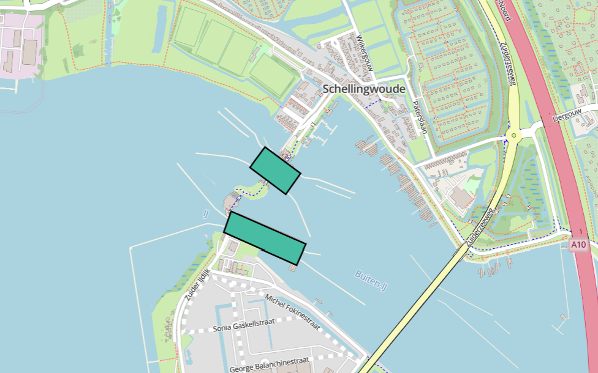
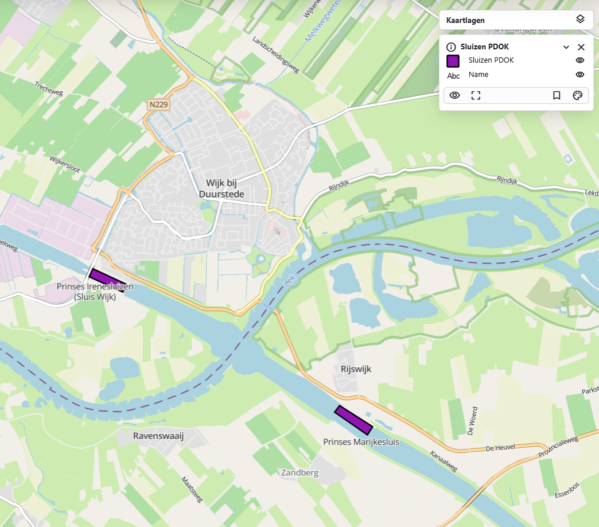
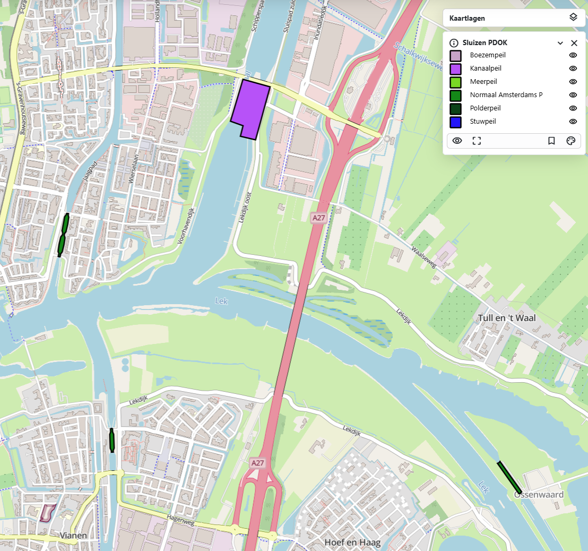

# {{ config.site_name }}

Vlakken
---
Voor deze handleiding over de styling van vlakken is gebruik gemaakt van de [dataset suizen](https://nationaalgeoregister.nl/geonetwork/srv/dut/catalog.search#/metadata/35f04ee9-6499-4fef-837e-12b81b6374b5). Deze is te vinden in o.a. het nationaal georegister van PDOK.
Aan de hand van deze dataset zullen enkele voorbeelden gegeven worden van de stylingsmogelijkheden. Alle simpele styling voorbeelden zijn onderdeel van de “genereer style” functie in MapGallery. Vervolgens worden de [geavanceerde stylingopties](#geavanceerde-styling) besproken.

Simpele styling
---

### Simpel vlak
```
{
  "name": "",
  "rules": [
    {
      "name": "Sluizen",
      "filter": ["==", "$type", "Polygon"],
      "symbolizers": [
        {
          "kind": "Fill",
          "color": "#47bea3",
          "opacity": 1,
          "outlineColor": "black",
          "outlineWidth": 2,
          "outlineOpacity": 1
        }
      ]
    }
  ]
}
```


De code hierboven is het resultaat van het genereren van een eenvoudige vlak weergave in MapGallery. Binnen rules zijn de stylingsregels beschreven. In de filter is gekozen voor alle geometrieën van het type "Polygon".

- Het type symbool is "fill", ofwel een vlak op de kaart. 
- De kleur #47bea3 in hex notatie, de code begint met # gevolgd door 6 tekens, bestaande uit drie paren, die respectievelijk de intensiteit van rood, groen en blauw (RGB) weergeven. Maar de basiskleuren worden ook herkend zoals red, green, indigo ect. 
-	De opacity bepaald de transparantie van het vlak. 
-	De outlineColor, ofwel de omlijning is zwart. Hierbij kan je gebruik maken van de zelfde kleur opties als bij de kleur van de vlak. 
-	De outlineWidth bepaald de dikte van de omlijning.
-	De outlineOpacity bepaald de transparantie van de omlijning.

### Vlakken met labels 
```
{
  "name": "",
  "rules": [
    {
      "name": "Sluizen PDOK",
      "filter": ["==", "$type", "Polygon"],
      "symbolizers": [
        {
          "kind": "Fill",
          "color": "#9015b2",
          "opacity": 1,
          "outlineColor": "black",
          "outlineWidth": 2,
          "outlineOpacity": 1
        }
      ]
    },
    {
      "name": "Name",
      "symbolizers": [
        {
          "kind": "Text",
          "size": 12,
          "color": "#111111",
          "label": { "args": ["name"], "name": "property" },
          "offset": [0, 2],
          "haloColor": "#FFFFFF",
          "haloWidth": 1
        }
      ]
    }
  ]
}
```


 Naast het gebruik van vlakken kan er ook informatie weergeven worden met labels. Hier is gekozen voor gebruik van het veld "Name" voor de inhoud van de labels.

- De name bepaald hoe het label heet in de legenda, dit kan naar smaak aangepast worden.
Size en color kunnen net als bij de andere vlakken aangepast worden.
- Bij “args”, na label: word het veld opgegeven voor de inhoud van de labels, in dit geval ["Name"]
- Onder offset word de afstand het label tot het vlak bepaald.
De labels hebben ook een omlijning of zogeheten gloed, de kleur en grootte hiervan word bepaald met haloColor en haloWidth.'

### Styling op categorie
```
{
  "name": "",
  "rules": [
    {
      "name": "Boezempeil",
      "filter": ["==", "referencelevelbebu", "Boezempeil"],
      "symbolizers": [
        {
          "kind": "Fill",
          "color": "#C8A2C8",
          "opacity": 1,
          "outlineColor": "black",
          "outlineWidth": 2,
          "outlineOpacity": 1
        }
      ]
    },
    {
      "name": "Kanaalpeil",
      "filter": ["==", "referencelevelbebu", "Kanaalpeil"],
      "symbolizers": [
        {
          "kind": "Fill",
          "color": "#b752f8",
          "opacity": 1,
          "outlineColor": "black",
          "outlineWidth": 2,
          "outlineOpacity": 1
        }
      ]
    },
    {
      "name": "Meerpeil",
      "filter": ["==", "referencelevelbebu", "Meerpeil"],
      "symbolizers": [
        {
          "kind": "Fill",
          "color": "#79d825",
          "opacity": 1,
          "outlineColor": "black",
          "outlineWidth": 2,
          "outlineOpacity": 1
        }
      ]
    }
  ]
}
```


Het is mogelijk om aparte vlakken te genereren voor verschillende categorieën. Voor de sluizen dataset is in dit voorbeeld gekozen voor styling op het veld "referencelevelbebu". Het gewenste veld kan geselecteerd worden wanneer men “Weergave op categorie” selecteert binnen het de genereer style functie. Qua code verschilt er niet veel met voorgaande voorbeelden, behalve dat deze dan uit opeenvolgende blokken bestaat met een verschillende filterwaarde voor het veld "referencelevelbebu". Let op, de voorbeeldcode beslaat alleen de eerste 3 types van de categorie.

Geavanceerde styling
---

### Geavanceerde labels
```
{
  "name": "",
  "rules": [
    {
      "name": "PDOK - Grenzen Omgevingsdiensten",
      "filter": ["==", "$type", "Polygon"],
      "symbolizers": [
        {
          "kind": "Fill",
          "color": "#7561b8",
          "opacity": 0.5,
          "outlineColor": "white",
          "outlineWidth": 2,
          "outlineOpacity": 1
        }
      ]
    },
    {
      "name": "Od naam",
      "symbolizers": [
        {
          "font": ["georgia"],
          "kind": "Text",
          "size": 12,
          "color": "#000000",
          "label": { "args": ["od_naam"], "name": "property" },
          "offset": [0, 0],
          "rotate": -25,
          "opacity": 1,
          "haloColor": "#FFFFFF",
          "haloWidth": 1
          "allowOverlap": false
        }
      ]
    }
  ]
}
```


Deze labels zijn geavandeerder, met meer optie voor persoonlijke voorkeur. Een groot gedeelte komt overeen met de simpele styling van labels. Hieronder worden de verschillende mogelijkheden uitgelegd:

-  Door een font te kiezen wordt het lettertype van het label aangepast. Dit zijn de mogelijke lettertypes die worden ondersteund:
    <ul>
    <li style="font-family: Arial;">Arial</li>
    <li style="font-family: Verdana;">Verdana</li>
    <li style="font-family: Sans-serif;">Sans-serif</li>
    <li style="font-family: 'Courier New';">Courier New</li>
     <li style="font-family: 'Lucida Console';">Lucida Console</li>
     <li style="font-family: Monospace;">Monospace</li>
     <li style="font-family: 'Times New Roman';">Times New Roman</li>
     <li style="font-family: Georgia;">Georgia</li>
     <li style="font-family: Serif;">Serif</li>
    </ul>
- Rotate zorgt ervoor dat de tekst schuin staat. "0" betekend dat de tekst recht blijft, bij "100" staat de tekst verticaal. Negatieve getallen zijn ook mogelijk.  
- De opacity bepaald de transparantie/doorzichtigheid. "1" is normaal en "0" is onzichtbaar.
- De optie allowOverlap bepaalt of de labels elkaar mogen overlappen. Als overlappen niet is toegestaan, verschijnen alle labels pas bij verder inzoomen op de kaart. Als overlappen wel is toegestaan, kunnen sommige labels onzichtbaar zijn doordat ze elkaar bedekken.

### Atribute-based punten
```
{
  "name": "Aantal inwoners",
  "rules": [
    {
      "name": "Klein",
      "filter": ["<", "aantalInwoners", 5000],
      "symbolizers": [
        {
          "kind": "Fill",
          "color": "red",
          "opacity": 1,
          "outlineColor": "black",
          "outlineWidth": 2,
          "outlineOpacity": 1
        }
      ]
    },
    {
      "name": "Middel",
      "filter": [
        "&&",
        [">=", "aantalInwoners", 5000],
        ["<", "aantalInwoners", 10000]
      ],
      "symbolizers": [
        {
          "kind": "Fill",
          "color": "orange",
          "opacity": 1,
          "outlineColor": "black",
          "outlineWidth": 2,
          "outlineOpacity": 1
        }
      ]
    },
    {
      "name": "Groot",
      "filter": [">=", "aantalInwoners", 10000],
      "symbolizers": [
        {
          "kind": "Fill",
          "color": "yellow",
          "opacity": 1,
          "outlineColor": "black",
          "outlineWidth": 2,
          "outlineOpacity": 1
        }
      ]
    }
  ]
}
```

Deze stijl definieert hoe punten op een kaart worden weergegeven op basis van het jaartal van "jaar_van_ingebruikstelling"

- Klein → gele vlakken (tot 5.000 inwoners)
    - ["<", "aantalInwoners", 5000]
- Middel → oranje vlakken (5.000 tot 10.000 inwoners).
    - [">=", "aantalInwoners", 5000],
      ["<", "aantalInwoners", 10000]
- Groot → rode vlakken (vanaf 10.000 inwoners)
    - [">=", "aantalInwoners", 10000]

Let op! Dit kan alleen worden gedaan als het datatype number is, anders kan deze styling niet.

### Zoom-based punten
```
{
  "rules": [
    {
      "name": "Groot",
      "symbolizers": [
        {
          "kind": "Mark",
          "color": "#CC3300",
          "radius": 6,
          "wellKnownName": "circle"
        }
      ],
      "scaleDenominator": { "max": 100000 }
    },
    {
      "name": "Middel",
      "symbolizers": [
        {
          "kind": "Mark",
          "color": "#CC3300",
          "radius": 4,
          "wellKnownName": "circle"
        }
      ],
      "scaleDenominator": { "max": 1000000, "min": 100000 }
    },
    {
      "name": "Klein",
      "symbolizers": [
        {
          "kind": "Mark",
          "color": "#CC3300",
          "radius": 2,
          "wellKnownName": "circle"
        }
      ],
      "scaleDenominator": { "min": 1000000 }
    }
  ]
}

```
| Schaalniveau | Bereik | Afbeelding |
| ------------- | ------- | ----------- |
| Klein  | Vanaf 1 000 000 |  |
| Middel | 100 000 – 1 000 000 |  |
| Groot  | Tot 100 000 |  |

Met deze styling wordt de weergave van punten afhankelijk van de schaal aangepast. In dit voorbeeld verandert de grootte van het punt, en dit kan worden gestuurd met "scaleDenominator" door een min en/of max waarde te geven.

- "scaleDenominator": { "max": 100000 } betekent dat de stijl zichtbaar is bij een schaal van 1:100.000 of dichterbij (meer ingezoomd).
- "scaleDenominator": { "min": 50000 } betekent dat de stijl pas zichtbaar wordt bij een schaal van 1:50.000 of dichterbij.

### Lijn met offset
```
{
  "name": "",
  "rules": [
    {
      "name": "PDOK - CBS Bevolkingskernen 2021",
      "filter": ["==", "$type", "Polygon"],
      "symbolizers": [
        {
          "kind": "Fill",
          "color": "blue",
          "opacity": 0.7,
          "outlineColor": "black",
          "outlineWidth": 3,
          "outlineOpacity": 1
        },
        {
          "kind": "Line",
          "color": "#AAAAAA",
          "width": 3,
          "perpendicularOffset": 2
        },
        {
          "kind": "Line",
          "color": "#AAAAAA",
          "width": 3,
          "perpendicularOffset": -2
        }
      ]
    }
  ]
}
````

Deze styling laat je een extra bufferlijn in het polygoon tekenen. In dit voorbeeld zijn twee buffers toegevoegd, aan zowel de binnen- als de buitenkant van de lijn een buffer getekend. Door "perpendicularOffset" aantepassen veranderd de buffer. Positieve waarden (bijv. 2) genereren een parallelle lijn aan de linkerkant en negatieve waarden (bijv. -2) aan de rechterkant. 

### 